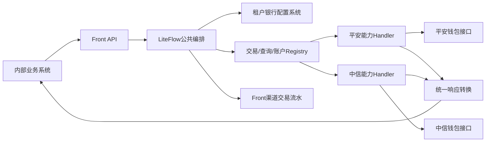

# SaaS 2.0 多银行渠道 Front 重构总体结构设计

> Wiki 入口：[WIKI-START.md](./WIKI-START.md)
> 状态：current（总体结构讨论稿）
> 验证状态：needs-source-check（具体业务字段、银行接口映射待逐业务线确认）
> 创建日期：2026-07-30
> 适用项目：SaaS 2.0 多银行渠道支付 Front

> 实施说明：本文保留总体设计和讨论依据；模块、类、DDL、LiteFlow、测试和完成标准以
> [04-front-service完整重构实施方案.md](./04-front-service完整重构实施方案.md) 为准；代码层级、返回对象、错误码和异常约束以
> [05-front代码开发约束.md](./05-front代码开发约束.md) 为准。

---

## 1. 文档定位

本文档用于记录 SaaS 2.0 多银行渠道 Front 的总体结构设计，作为后续逐业务线、逐银行、逐接口核对字段的母文档。

当前阶段只确定：

- Front 的系统边界与职责；
- 租户和银行配置定位方式；
- 对外请求和内部执行上下文；
- 交易、账户、查询三类业务路由；
- 银行 Handle 与具体交易/查询方法的职责；
- LiteFlow 公共流程编排；
- 渠道交易流水及统一响应的基本结构；
- 平安、中信查询能力的初步差异。

当前阶段不确定：

- 每个业务接口的最终请求字段；
- 每个银行 `specialData` 的完整字段；
- 各银行响应到 Front 通用响应的完整映射；
- 查询结果对象的最终字段；
- 文件查询、批量交易等后续能力的详细设计。

后续以本目录为根目录，逐业务线增加详细设计文档。

---

## 2. 背景与目标

### 2.1 背景

现有 `fund-catering-front-service` 已具备以下结构：

```text
Facade/Controller
  → Service
  → Router/Registry
  → 平安/中信能力 Handle
  → 钱包接口客户端
```

现有系统仅作为结构和银行接口实现参考，新 Front 不承担旧对象、旧配置查询方式和旧接口的兼容责任。

### 2.2 建设目标

新 Front 面向内部供应链等业务系统，提供统一的多银行钱包渠道能力：

1. 业务系统使用统一核心业务对象调用 Front；
2. 业务系统按银行和接口契约组装 `specialData`；
3. Front 根据租户和银行编码获取银行配置；
4. Front 根据业务分类和银行编码路由到具体银行 Handle；
5. Handle 将通用业务数据转换为银行钱包请求；
6. Front 将不同银行响应转换为统一响应；
7. 交易类请求保存 Front 渠道流水并关联业务订单；
8. 后续新增银行时，不修改公共租户配置对象和既有银行实现。

### 2.3 非目标

- 不复用旧系统的 `operator/orgCode/firstCode` 配置定位方式；
- 不让业务系统传递银行密钥、商户号、请求地址等敏感配置；
- 不将银行 `bizFunc`、`channelNo` 暴露给业务系统决定；
- 不强制不同银行所有查询能力一一对应；
- 不在首版提前设计未确认的银行字段。

---

## 3. 核心约束

### 3.1 租户与银行配置

- `platformCode` 表示银行编码；
- 一个租户在同一家银行只能启用一套银行渠道配置；
- 银行配置唯一键为：

```text
tenantId + platformCode
```

- JSON 和数据库字段统一使用 `tenant_id`；
- Java 字段统一使用 `tenantId`。

### 3.2 配置安全

以下字段只能由 Front 从配置系统获取：

```text
mchntId
mchntMbrId
appIdBank
appKeyBank
urlBank/baseUrl
publicKey/privateKey
signAlgorithm
encryptAlgorithm
银行特有静态配置
```

业务系统不得通过请求或 `specialData` 覆盖上述配置。

### 3.3 银行协议参数

以下参数由银行 Handle 根据银行和业务能力确定：

```text
channelNo
bizFunc
银行接口路径
签名与加密执行方式
钱包请求 reserve 映射
银行响应转换规则
```

---

## 4. 总体架构



### 4.1 分层职责

| 分层 | 主要职责 |
|---|---|
| API 层 | 接收请求、基础格式校验、确定业务接口 |
| Application/LiteFlow 层 | 根据具体 API 编排具名链、调用 Handle 上下文装配、公共异常处理 |
| Router/Registry 层 | API 先确定领域；领域 Registry 根据 `platformCode → BankCode` 与 API 内部 capability 精确选择能力 Handler |
| Handle 层 | 一个 Handler 对应一个“银行 + capability”；统一父类装配配置上下文，Handler 使用固定业务表完成重复交易检查、渠道流水、请求组装、`bizFunc/channelNo`、银行调用和响应转换 |
| Config 层 | `TenantBankConfigProvider` 根据 `tenantId + bankCode` 获取租户银行配置 |
| Infrastructure 层 | HTTP、签名、加密、配置客户端、数据库持久化 |

---

## 5. 请求对象设计

### 5.1 对外请求：两部分

业务系统实际传给 Front 的请求由两部分组成：

```java
public class FrontRequest<T extends FrontBaseRequestData> {
    // a. 租户、门店、银行定位信息及银行无关业务参数
    private T baseData;

    // b. 银行和接口特有的动态业务参数
    private JSONObject specialData;
}
```

```java
public class FrontBaseRequestData {
    private String tenantId;
    private String storeId;
    private BankCode platformCode;
}
```

具体交易、交易查询和账户查询对象继承 `FrontBaseRequestData`。`baseData` 只保留内部业务系统的统一
业务字段；收付款账户、会员编号、姓名、卡号及银行协议专用筛选条件进入 `specialData`，使用银行协议
原始 key，由具体 Handle 显式映射。

交易公共基础对象增加 `payStoreNo/payStoreId/recStoreNo/recStoreId` 两组收付款门店字段。
单笔状态查询基础对象使用 `frontSsn/bizOrderNo/bizSubOrderNo`，其中后两者分别是业务主流水和
业务子流水。交易明细返回的每条 `TransactionDetailItem` 包含自己的 `JSONObject specialData`，
用于承接该笔银行明细的 `reserveMap`；分页结果继承的 `specialData` 只保存查询级扩展字段。

### 5.2 内部执行上下文

Front 完成“银行 + capability”能力 Handler 路由后，由 `AbstractBankHandle` 形成只传给银行 Handler 的
三段式上下文：

```java
public record BankRequestContext<T extends FrontBaseRequestData>(
    T baseData,
    JSONObject specialData,
    TenantBankAccountConfig accountConfig) {
}
```

Application Service 入口使用 `FrontFlowContext.from(request, capability)` 创建统一非泛型业务 Slot。
`capability` 由当前 API 方法固定写入，调用方不得传入；它参与正确领域 Registry 的
`(BankCode, FrontCapability)` 精确路由，同时用于日志和渠道流水记录。它不得用于猜测领域、统一能力
预校验或公共 Dispatch `switch`。`FrontExecutionInfo` 属于该外层执行上下文，用于记录执行阶段和关键时间，不混入对外请求，
也不改变上述三段式 Handle 上下文。当前 Context 创建和阶段维护已落地；LiteFlow 执行器、节点和规则链
仍待后续接入。

### 5.3 数据来源

| 数据部分 | 来源 | Front 职责 |
|---|---|---|
| `baseData` | 业务系统 | 校验租户、门店、银行并使用具体接口强类型字段 |
| `accountConfig` | 配置系统 | 统一父类先查 `support_bank_config` 解析模板 key，再按 `tenantId + key` 查询并组装 |
| `specialData` | 业务系统 | 校验、解析、显式映射 |
| `executionInfo` | Front | 生成 `frontSsn`、接口编码、执行时间等 |

---

## 6. 租户银行配置

### 6.1 配置存储与 Front 对象结构

配置系统以扁平 `JSONObject` 形式返回，Front 组装后的账户配置对象为：

```text
TenantBankAccountConfig
├─ appId
├─ appKey
├─ url
├─ mchntId
├─ mchntMbrId
└─ accountSpecialData: JSONObject
```

说明：

- `appId/appKey/url/mchntId/mchntMbrId` 为跨银行共有的账户配置属性；
- 平安 `accountSpecialData` 只保存 `txnClientNo/mrchCode/stlAcctNo`，其中 `stlAcctNo` 是资金汇总账号；
- 中信 `accountSpecialData` 保存 `default_role/default_fund_type/self_role/self_fund_type/`
  `self_dealType/self_store_no/self_store_id`；这些字段对中信是通用账户配置，但不是跨银行字段；
- `transSsn` 由具体银行 Handle 按银行规则生成，`transTime` 每次请求生成，`bizFunc/chnlNo`
  由银行和能力使用常量确定，四者不进入账户配置；
- `specialData` 是单次业务请求特定参数，`accountSpecialData` 是租户银行账户特定静态配置，
  两者是独立 `JSONObject`，不得互相覆盖。

### 6.2 银行账户配置组装策略

配置系统边界使用 `JSONObject`。通用父类组装强类型通用字段，银行策略只挑选各自账户特定字段：

```java
public interface BankAccountConfigAssembler {
    BankCode bankCode();
    TenantBankAccountConfig assemble(JSONObject sourceConfig);
}
```

示例：

```text
AbstractBankAccountConfigAssembler → 组装通用字段
PingAnBankAccountConfigAssembler    → 组装平安 accountSpecialData
CiticBankAccountConfigAssembler     → 组装中信 accountSpecialData
```

策略路由使用构造器注入 `List<BankAccountConfigAssembler>` 建立不可变 `EnumMap`，
同一银行重复策略必须启动失败。新增银行只增加自己的组装策略和 Handle，不扩充
`TenantBankAccountConfig` 的银行专属字段。

配置查询原始 key 和账户配置 `JSONObject` 字段 key 统一放在
`catering-common-core/com.chinaums.common.core.constant.front`：查询 key 使用
`FrontBankConfigQueryKeys` 保存 `support_bank_config`；具体银行配置模板 key 由该配置动态返回；
通用、平安、中信字段分别使用
`FrontBankAccountConfigKeys/PingAnBankAccountConfigKeys/CiticBankAccountConfigKeys`。
钱包公共请求字段、transfer/consume 协议字段和响应判定分别使用
`FrontBankRequestConstants/CiticTransferContractKeys/PingAnTransferContractKeys/FrontBankResponseConstants`，禁止在 Handle
散落字符串字段名和银行原始成功码。
查询 key 在公共层只保存原始值，不绑定银行，最终映射由真实 Provider 显式选择。

---

## 7. specialData 设计

### 7.1 职责边界

`specialData` 由业务系统根据：

```text
platformCode + 具体业务接口
```

选择对应参数组装工具生成。

数据流：

```text
银行调用所需动态数据
  → 业务系统银行参数组装工具
  → specialData
  → Front银行Handle校验和解析
  → 钱包请求reserve
```

业务系统负责：

```text
银行使用的账户、会员、姓名、卡号及能力特有动态字段 → specialData
```

Front 负责：

```text
specialData → 银行钱包reserve
```

### 7.2 推荐格式

```json
{
  "outAcctNo": "银行协议原始字段值",
  "inAcctNo": "银行协议原始字段值"
}
```

`specialData` 使用扁平 `JSONObject`，不增加 `schemaVersion/data` 包装层。不同银行、不同能力使用各自
常量白名单解析，禁止整体透传到银行 reserve。

### 7.3 使用约束

`baseData` 只保存内部业务系统公共数据；`specialData` 保存银行和接口使用的动态业务参数，key 使用
对应银行协议原始字段名。金额、业务订单、业务主/子记录和收付款门店等内部公共语义仍保留在 baseData。

禁止保存：

```text
tenantId
platformCode
frontSsn
channelNo
bizFunc
mchntId
mchntMbrId
appIdBank
appKeyBank
urlBank
签名或加密密钥
核心金额和业务订单号
```

Handle 必须：

1. 校验 `schemaVersion`；
2. 校验字段白名单；
3. 校验必填、类型、长度、格式和枚举；
4. 拒绝未知字段；
5. 显式映射钱包字段；
6. 禁止直接 `putAll` 合并到钱包 `reserve`。

### 7.4 参数契约

Front 团队按“银行 + 业务接口”发布 `specialData` 参数契约，至少包含：

```text
字段编码
中文含义
是否必填
数据类型
长度和格式
枚举范围
条件必填规则
合法示例
钱包目标字段
敏感级别
契约版本
```

业务开发人员根据契约自行开发组装工具。

---

## 8. 业务分类与 Router

### 8.1 一级业务分类

首版业务大类：

```java
public enum FrontBusinessCategory {
    TRANSACTION,
    ACCOUNT,
    QUERY
}
```

对应三个独立 Router：

```text
TransactionRouter
AccountRouter
QueryRouter
```

### 8.2 Registry Key

每个 Registry 已经表达业务大类，API 方法内部又固定具体能力，因此领域内使用类型安全复合 key：

```text
(BankCode, FrontCapability)
```

示例：

```java
Map<BankCapabilityKey, TransactionCapabilityHandler> transactionHandlerMap;
Map<BankCapabilityKey, AccountCapabilityHandler> accountHandlerMap;
Map<BankCapabilityKey, QueryCapabilityHandler> queryHandlerMap;
```

路由结果：

```text
TransactionRegistry + (PING_AN, TRANSFER) → PingAnTransferHandler
TransactionRegistry + (CITIC, REFUND)     → CiticRefundHandler
QueryRegistry + (CITIC, TRANSACTION_STATUS_QUERY) → CiticTransactionStatusQueryHandler
```

领域由 API/应用服务直接确定，不放进同一个统一复合键，也不根据 capability 名称反推。`bizFunc`、
`accountType`、交易类型和表名均不得进入 Registry key。

---

## 9. Query 大类设计

### 9.1 银行查询能力 Handler

每个查询 API 已经在服务内部确定 `FrontCapability`。`QueryHandlerRegistry` 根据
`(BankCode, FrontCapability)` 直接选中具体查询能力 Handler；请求不传 `QueryCapability`，通用执行节点
不再通过 `switch` 选择大 Query Handle 的方法。

```java
public interface QueryCapabilityHandler {

    BankCode bankCode();
    FrontCapability capability();
    FrontBaseResult execute(FrontFlowContext context);
}
```

调用链：


### 9.2 查询业务类型来源

查询业务类型只由具体 API 方法确定：

```text
/query/transaction-status
/query/sub-account-balance
/query/sub-account-detail
/query/platform-account-detail
```

请求不传 `QueryCapability/FrontCapability`。如果未来增加新的查询场景，应增加明确 API、枚举值和支持
银行的单能力 Handler；Registry 自动按声明注册，不修改统一查询 `switch`。

### 9.3 Query Handler 内部结构

一个银行按查询能力拆为独立 Handler；同银行能力之间允许复用银行内部 Service，但不得恢复大 Handle
内部的 capability switch：

```text
channel/pingan/query
  ├─ PingAnTransactionStatusQueryHandler
  ├─ PingAnAccountBalanceQueryHandler
  └─ ...

channel/citic/query
  ├─ CiticTransactionStatusQueryHandler
  ├─ CiticPlatformTransactionDetailsQueryHandler
  └─ ...
```

约束：

- 不把所有查询逻辑写进一个超长方法；
- 具体 API 固定 capability，Query Registry 直接返回对应 Handler；
- `specialData` 只负责银行特有过滤参数；
- 银行未注册该 capability 时由 Registry 返回 `CAPABILITY_NOT_SUPPORTED`；
- 某个能力实现过大时再抽取银行内部 Service。

---

## 10. 平安与中信查询能力初步对比

### 10.1 账户余额

| Front 业务能力 | 平安 | 中信 |
|---|---|---|
| 平台账户余额 | 资金汇总账户余额 | 交易资金账户余额 |
| 子账户余额 | 会员见证子账户余额 | 用户登记簿余额 |
| 功能账户余额 | 功能子账户余额列表 | 公共登记簿余额 |
| 用户状态 | 暂无明确对应能力 | 用户状态查询 |

### 10.2 交易状态

| Front 业务能力 | 平安 | 中信 |
|---|---|---|
| 单笔交易状态 | 不同原交易类型映射不同 `bizFunc` | 统一交易状态查询，再通过交易类型过滤 |
| 特殊终态 | 支持特定批量交易终态 | 暂无完全对应 |
| 小额鉴权结果 | 独立能力 | 暂无完全对应 |
| 回单验证码 | 独立能力 | 暂无完全对应 |
| 预清分核销状态 | 暂无完全对应 | 独立能力 |

### 10.3 交易明细

中信主要分为：

```text
登记簿/子账户交易明细
平台交易资金账户明细
```

平安主要分为：

```text
子账户时间段交易明细
在途清算结果
普通转账充值明细
清分提现明细
提现退票明细
银行费用扣收结果
冻结支付明细
```

初步结论：

- 子账户交易明细可以抽象成相对通用能力；
- 平台账户交易明细在两个银行之间不是一一对应；
- 后续需要根据业务系统实际需要的查询结果拆分业务场景；
- 同一个银行接口下仅作为过滤条件的交易类型可以放入 `specialData`；
- 会改变查询语义或返回对象结构的场景，应使用独立 API/Handle 方法表达，不能塞进 `specialData`
  或恢复统一 `QueryCapability` 分派。

### 10.4 文件查询

平安流程：

```text
查询已生成的对账文件信息
  → 获取文件名、密码、路径、提取码
  → SFTP下载
```

中信流程：

```text
申请生成文件
  → 查询文件处理状态
  → 下载文件
```

文件能力后续单独设计，不纳入第一阶段交易查询和账户查询实现。

---

## 11. LiteFlow 公共编排

LiteFlow 负责 Router 前后的公共流程，不替代银行 Router。

### 11.1 交易链路

```text
请求校验
  → 当前交易 API 固定 capability
  → TransactionRegistry(bankCode, capability)
  → AbstractBankHandle.prepareContext
  → 银行交易能力 Handler
  → 使用当前业务固定 Mapper 执行重复交易检查
  → 生成 frontSsn/创建渠道交易流水
  → 解析银行配置和校验specialData
  → 统一响应转换
  → 更新渠道交易流水
  → 返回
```

### 11.2 查询链路

```text
请求校验
  → 当前查询 API 固定 capability
  → QueryRegistry(bankCode, capability)
  → AbstractBankHandle.prepareContext
  → 银行查询能力 Handler
  → 解析银行配置和校验specialData
  → 通用 execute 调用已选 Handler
  → 统一查询响应转换
  → 返回
```

### 11.3 LiteFlow 与 Router 边界

| LiteFlow | Router/Handle |
|---|---|
| API 固定 capability，具名链确定领域并编排公共步骤 | 领域 Registry 按 `(BankCode, FrontCapability)` 选择唯一能力 Handler |
| 调用上下文装配步骤 | `AbstractBankHandle` 统一加载、校验租户银行配置 |
| 编排具名业务执行节点 | 使用当前业务固定 Mapper 执行重复交易检查和渠道流水维护 |
| 公共异常处理 | 组装钱包报文、调用银行接口并转换响应 |

---

## 12. 银行 Handle 职责

每个银行 Handle 负责：

1. 继承 `AbstractBankHandle`，统一按 `tenantId + bankCode` 加载并校验租户银行配置；
2. 从三段式 `BankRequestContext` 获取基础数据、特殊数据和账户配置；
3. 从账户配置读取通用字段及当前银行 `accountSpecialData`；
4. 按接口契约解析和校验 `specialData`；
5. 读取强类型 `baseData`；
6. 确定 `channelNo`；
7. 确定 `bizFunc`；
8. 确定具体银行接口路径；
9. 组装钱包请求对象及钱包 `reserve`；
10. 执行签名、加密和银行调用；
11. 将银行响应转换为 Front 统一响应。

具体银行 Handle 不得绕过统一父类自行查询租户配置，也不得将完整配置写入日志。

银行调用上下文与银行业务请求对象必须分离，密钥、URL 等配置不得序列化进钱包业务报文。

---

## 13. 交易业务范围

首版交易业务候选：

```text
TRANSFER            转账
CONSUME             消费
WITHDRAW            提现
REFUND              退款
TRANSFER_RECALL     转账撤销/召回
PLATFORM_PAY        平台付款
PLATFORM_RECEIVE    平台收款
RECHARGE            充值
SUB_ACCOUNT_TRANSFER 子账户转账
```

短信申请、验证码验证、交易授权等属于交易辅助调用，是否作为独立主交易待具体业务线确认。

---

## 14. Front 渠道交易流水

### 14.1 定位与物理表边界

渠道交易流水记录：

- Front 发给钱包/银行的交易请求及两层银行原始响应；
- Front 统一响应和归一化状态；
- 来源业务系统、业务交易类型、业务主/子记录 ID 及主/子订单；
- 付款/收款门店、金额、手续费等公共业务数据；
- 业务及银行所需明确字段；不保存整段 `baseData/specialData` 快照；
- 中信退款的原业务主子流水及银行协议必填字段；不关联 Front 本地原转账、消费记录。
  平安退款是否需要本地原交易关联按 `FRONT-TODO-002` 等待确认。

物理表必须按“银行 + 交易业务”拆分：

```text
中信 6 张：transfer / consume / refund / withdraw / platform_pay / platform_receive
平安 4 张：transfer / consume / refund / withdraw
```

平安 `TRANSFER_AUTH/TRANSFER_AUTH_CODE_RESEND` 共用平安转账表并通过 `capability` 区分；不为某银行
不支持的能力创建空表。完整表名、字段和索引以
[09-channel-transaction-ddl](09-channel-transaction-ddl.md) 为准。

### 14.2 路由与业务关联

```text
具体 API            → 固定 capability 和领域
platformCode         → BankCode
领域 Registry        → (BankCode, capability) 对应的能力 Handler
能力 Handler         → 固定业务 Repository
```

capability 由 API 方法内部固定，既参与领域 Registry 的“银行 + 能力”精确路由，也写入渠道流水；平安
共享转账表用它区分记录。不得用它猜测领域、执行统一能力预校验、在公共 Dispatch 中选择方法或动态选择
Repository。具体能力 Handler 使用自己的固定 Repository，不接收来源业务表名，也不使用字符串拼接
动态 SQL。

每张表必须明确保存：

```text
biz_system_code
biz_transaction_type
biz_transaction_id
biz_sub_transaction_id
biz_request_no
biz_order_no
biz_sub_order_no
pay/rec/withdraw/bank_card 相关明确字段
reserve1 / reserve2 / reserve3
```

约束：

- `frontSsn` 使用全局生成算法，每张表再使用唯一索引；
- 发送前在当前银行业务表按 `(tenant_id, biz_order_no, biz_sub_order_no)` 执行重复交易检查，
  命中返回“交易已存在”，不调用银行、不重放旧结果；
- 业务记录 ID 使用字符串兼容数字 ID 和 UUID，不建立跨服务数据库外键；
- 不保存完整银行请求/响应快照；
- 不保存完整银行配置、银行密钥、验证码或支付密码；账户、会员、姓名和卡号允许按内部明确列保存，
  本期不要求数据库字段加密，但不得输出到日志、异常消息或普通接口响应；
- 调用银行前创建 `INIT`，实际发送前更新为 `SENDING`；
- 超时或结果不确定时记录 `UNKNOWN`，不能直接记录失败；
- 资金交易不能因超时自动盲目重发。

---

## 15. 统一响应

```java
R<FrontTransactionResult>

public class FrontBaseResult {
    private String frontRespCode;
    private String frontRespDesc;
    private JSONObject specialData;
}
```

单条交易、交易状态和账户查询由公共 `R` 包装确定类型结果，例如 `R<FrontTransactionResult>`；
分页明细查询直接返回工程统一的 `TableDataInfo<TransactionDetailItem>`，禁止再使用 `R` 包装。
`FrontBaseResult.specialData` 保存当前银行和接口的特殊响应字段。Handle 内部直接返回确定的
`FrontBaseResult` 子类，禁止 `FrontResponse` 中间层和无法约束的 `<T> T` 返回。

`R` 与 `FrontErrorCode` 统一位于 `catering-common-core`，API 和功能模块不得重复定义。
具体结果调用 `applyFrontResponse(FrontErrorCode)` 同时设置统一码和统一说明；钱包平台码和银行渠道码
只用于 Handle 判定及渠道流水审计，不得直接成为 `frontRespCode/frontRespDesc`。

```java
public class FrontTransactionResult extends FrontBaseResult {
    private String frontSsn;

    private FrontTransactionStatus frontStatus;

    private String frontQueryId;

    private String frontRemark;

    private String frontTransDate;

    private String frontTransTime;
}
```

建议状态：

```text
PROCESSING
SUCCESS
FAILED
UNKNOWN
```

字段语义：

| 字段 | 语义 |
|---|---|
| `frontRespCode` | Front 统一响应码，不直接透传银行响应码 |
| `frontRespDesc` | Front 统一响应描述 |
| `frontSsn` | Front 渠道流水号 |
| `frontStatus` | 统一交易状态 |
| `frontQueryId` | Front 对外查询标识 |
| `frontRemark` | Front 备注 |
| `frontTransDate` | Front 受理日期 |
| `frontTransTime` | Front 受理时间 |

查询接口后续使用独立响应对象，不强制复用交易响应。

---

## 16. 项目模块草案

当前代码复用工程既有 API 聚合模块，按以下边界创建：

```text
catering-api
└─ catering-api-front
   └─ 对外 API、请求响应模型、常量和枚举

catering-common/catering-common-core
└─ 统一返回主体 R、Front 公共错误码与 FrontException

catering-modules/catering-front
└─ 功能实现、异常转换、服务配置与测试
```

Service 内按 `application/controller/route/handle/channel/context/handler` 分层。银行协议 DTO、配置、
客户端、签名与加密实现后续放入各自银行包，不能进入 `catering-api-front`。

---

## 17. 后续业务线文档规划

后续在当前目录逐项增加：

```text
05-front代码开发约束.md（已完成）
06-transfer-consume字段契约.md（已完成首版）
07-transferAuth-resendTransferAuthCode字段契约.md（已完成首版）
08-withdraw-refund-platform-transfer字段契约.md（已完成首版）
09-channel-transaction-ddl.md（已完成首版）
10-账户查询详细设计.md
11-交易状态查询详细设计.md
12-平台交易明细查询详细设计.md
13-交易明细查询详细设计.md
```

租户银行配置、`specialData`、LiteFlow、错误码状态机和文件能力文档在对应业务字段确认后继续追加；
文件编号和拆分方式可随业务核对过程调整。

---

## 18. 待确认事项

### 18.1 总体设计

- [ ] 新 Front 最终项目名和 Maven 坐标；
- [ ] 首版 LiteFlow 版本；
- [ ] 是否一个统一查询入口，还是每种查询能力独立 API；
- [ ] 配置系统接口缓存策略；
- [ ] `frontQueryId` 是否直接使用 `frontSsn`；
- [ ] 是否首版增加独立调用明细日志表。

### 18.2 交易业务

- [ ] 首版交易业务最终范围；
- [ ] 每类交易核心 `baseData`；
- [ ] 重复交易键和主/子订单关系；
- [ ] 退款原交易定位及协议字段；中信按 `FRONT-P1-005`，平安按 `FRONT-TODO-002`；
- [ ] 平安、中信 `specialData` 字段；
- [ ] 银行响应到 Front 状态的映射。

### 18.3 查询业务

- [x] 查询业务由具体 API/Handle 方法表达，不再设计 `QueryCapability` 请求字段或统一分派；
- [ ] 平台账户明细的统一业务语义；
- [ ] 子账户明细统一字段；
- [ ] 交易状态查询如何使用渠道交易流水自动补参；
- [ ] 平安独有查询能力是否对业务系统开放；
- [ ] 中信独有查询能力是否对业务系统开放；
- [ ] 查询分页和汇总/明细模式；
- [ ] 查询统一响应对象。

---

## 19. 当前参考资料

### 19.1 银行接口文档

```text
/Users/limeng/workspaces/IdeaProjects_saas_dep/saas2.0-memory-hub/docs/客户钱包应用平台_接口文档-平安项目(总)v5.5.doc

/Users/limeng/workspaces/IdeaProjects_saas_dep/saas2.0-memory-hub/docs/中信E管家产品客户钱包应用平台_接口文档-内部集成平台v4.7.doc
```

### 19.2 旧项目结构参考

```text
/Users/limeng/workspaces/IdeaProjects_lsym_dep/slhy/fund-catering/fund-catering-front
```

旧项目只用于参考：

```text
Router/Handle结构
平安和中信接口请求实现
现有钱包字段
现有响应解析
```

不作为新 Front 的兼容性约束。
