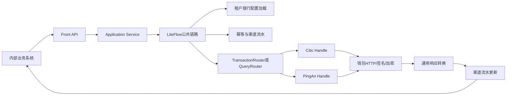

# SaaS 2.0 多银行渠道 Front Service 完整重构实施方案

> 状态：framework-implemented（三模块、API、Router、Handle 骨架已创建）
> 创建日期：2026-08-03
> 适用范围：新多银行渠道支付 Front
> 参考项目：`fund-catering-front-service`
> 首期银行：中信、平安
> LiteFlow 基线：跟随当前工程 `2.12.1`

---

## 1. 结论与完整性判断

### 1.1 现有方案是否可行

可行。

旧 `fund-catering-front-service` 的以下结构可以继续参考：

```text
API/Controller
  → Application Service
  → Router
  → 银行 Handle
  → 钱包 HTTP 客户端
```

但新项目只参考技术结构，不兼容旧请求对象、旧配置定位方式、旧返回对象和旧数据库结构。

### 1.2 当前记忆体文档是否足够直接开发

在本文档补充前，现有文档只达到“总体架构可讨论、银行能力可继续核对”的程度，还不能直接让开发 AI 一次生成完整工程，缺少：

1. 确定的 Maven 模块和 package 结构；
2. 类级别职责和依赖方向；
3. 完整 API、请求、响应、枚举清单；
4. LiteFlow 上下文、节点、链路和异常收口方式；
5. Router 注册方式与重复实现校验；
6. 渠道流水 DDL、幂等规则和状态迁移；
7. 配置系统适配端口；
8. 中信、平安 Handle 骨架及未接入行为；
9. 测试边界和可验证的完成标准。

本文档补齐上述内容后，开发 AI 可以一次性完成：

- 新工程骨架；
- API 契约和公共业务对象；
- Controller、Application Service；
- LiteFlow 公共编排；
- Router、Handle SPI 和注册表；
- 租户配置端口和内部配置模型；
- 渠道流水、幂等、状态机；
- 公共 HTTP、日志脱敏、异常处理骨架；
- 中信、平安 Handle 空实现骨架；
- 非银行协议相关单元测试和集成测试。

开发 AI 不能在没有逐接口确认的情况下完成：

- 银行请求 DTO 的最终字段；
- `specialData` 到钱包 `reserve` 的最终映射；
- 银行响应到通用响应的最终映射；
- 每个接口的 `bizFunc/channelNo/path` 最终配置；
- 中信、平安签名、加密、验签的生产实现；
- 银行特殊状态码的最终归一化；
- 配置系统真实接口尚未确定时的生产适配器。

因此，“一次性做完”的准确边界是：

```text
一次完成公共框架、业务契约、流程、路由、流水、测试和银行骨架；
逐接口补充中信/平安 Handle 内的银行协议实现。
```

---

## 2. 建设目标与非目标

### 2.1 建设目标

新 Front 面向内部供应链等业务系统，提供统一多银行钱包能力：

1. 业务系统只理解 Front 业务对象，不理解钱包报文；
2. Front 根据 `tenantId + platformCode` 获取银行配置；
3. Router 根据 `platformCode` 选择中信或平安 Handle；
4. Handle 决定钱包接口、`bizFunc`、`channelNo` 和银行字段；
5. 交易类请求建立 Front 渠道流水；
6. 不同银行响应转换成 Front 通用对象；
7. 不支持和未接入能力必须明确返回错误，禁止返回 `null` 或模拟成功；
8. 后续增加银行时，不修改公共租户配置 Java 类和既有银行 Handle。

### 2.2 非目标

- 不兼容旧 `operator/orgCode/firstCode` 配置定位模式；
- 不接受业务系统传入银行密钥、URL、商户号和算法；
- 不允许调用方指定 `bizFunc/channelNo`；
- 不将所有银行特殊字段堆入一个公共配置对象；
- 不在 Router Key 中加入银行接口类型、交易类型和 `bizFunc`；
- 不让 LiteFlow 规则直接承担银行协议分派；
- 首期不实现开户、绑卡、销户、文件查询、充值和批量交易。

---

## 3. 技术基线与默认实施变量

为保证开发 AI 可以直接执行，未另行指定时使用以下默认值：

| 项目 | 默认值 |
|---|---|
| Java | 17 |
| Spring Boot | 3.5.15 |
| Spring Cloud | 2025.0.3 |
| LiteFlow | 2.12.1，跟随当前 `cateringsass` 工程 |
| ORM | MyBatis Plus |
| JSON | Fastjson2 `JSONObject` |
| 数据库 | MySQL 8 兼容语法 |
| 金额 | `Long`，统一使用人民币分 |
| 中信编码 | `zxegj` |
| 平安编码 | `pajzb` |
| 默认币种 | `CNY` |
| 日期 | `yyyyMMdd` 字符串 |
| 时间 | `HHmmss` 字符串 |

当前工程名：

```text
catering-modules/catering-front
```

当前基础包：

```text
com.chinaums.front
```

---

## 4. 首期完整业务能力

### 4.1 交易能力

| 能力编码 | 中文名称 | 是否记录渠道流水 | 银行 Handle 方法 |
|---|---|---:|---|
| `TRANSFER` | 普通转账 | 是 | `transfer` |
| `TRANSFER_AUTH` | 授权转账/短信鉴权转账 | 是 | `transferAuth` |
| `TRANSFER_AUTH_CODE_RESEND` | 授权码发送或重发 | 否，仅记录脱敏审计日志 | `resendTransferAuthCode` |
| `CONSUME` | 消费 | 是 | `consume` |
| `REFUND` | 退款 | 是 | `refund` |
| `WITHDRAW` | 提现 | 是 | `withdraw` |
| `PLATFORM_PAY` | 平台付款 | 是 | `platformPay` |
| `PLATFORM_RECEIVE` | 平台收款 | 是 | `platformReceive` |

说明：

- “授权转账”在当前文档中只确认了平安短信鉴权转账；不能写成真正的授信额度转账；
- 授权码发送和重发对外可以使用同一个接口，通过本次请求号保证防重；
- 消费和普通转账即使银行底层使用同一个接口，Front 仍保留不同能力编码；
- 平台收款和平台付款必须拆开，不能使用一个方向字段模糊表达；
- 平安平台收付款当前没有确认等价接口，Handle 骨架返回待接入或不支持。

### 4.2 查询能力

| 能力编码 | 中文名称 | 银行 Handle 方法 |
|---|---|---|
| `ACCOUNT_STATUS_QUERY` | 账户状态查询 | `queryAccountStatus` |
| `ACCOUNT_BALANCE_QUERY` | 账户余额查询 | `queryAccountBalance` |
| `TRANSACTION_STATUS_QUERY` | 单笔交易状态查询 | `queryTransactionStatus` |
| `PLATFORM_TRANSACTION_DETAIL_QUERY` | 平台交易明细查询 | `queryPlatformTransactionDetails` |
| `TRANSACTION_DETAIL_QUERY` | 子账户/会员交易明细查询 | `queryTransactionDetails` |

账户余额查询通过核心字段 `accountScope` 区分：

```text
PLATFORM_FUNDS_ACCOUNT
USER_SUB_ACCOUNT
FUNCTIONAL_ACCOUNT
```

查询范围属于业务语义，必须位于强类型 `baseData`，不能放入 `specialData`。

虽然本轮用户列举时没有再次单独写出“交易状态查询”，首期仍必须保留该能力，因为交易超时、提现受理态、退款原交易校验和 `UNKNOWN` 流水补偿都依赖它。

---

## 5. 总体调用流程



交易标准链路：

```text
请求校验
→ 加载租户银行配置
→ 解析银行配置
→ 校验specialData
→ 幂等检查
→ 生成frontSsn
→ 创建渠道流水
→ Router选择银行Handle
→ Handle调用钱包
→ 统一响应
→ 更新渠道流水
→ 返回
```

查询标准链路：

```text
请求校验
→ 加载租户银行配置
→ 解析银行配置
→ 校验specialData
→ Router选择银行QueryHandle
→ 调用具体查询方法
→ 统一查询响应
→ 返回
```

---

## 6. Maven 模块设计

保留旧项目三模块形式，但重新约束模块职责：

```text
catering-front/
├── pom.xml
├── catering-front-api/
├── catering-front-common/
└── catering-front-service/
```

### 6.1 `front-api`

只保存其他业务系统编译期需要依赖的内容：

- Feign/API 接口；
- 对外请求对象；
- 对外响应对象；
- 通用业务枚举；
- Bean Validation 注解。

禁止放入：

- 银行请求和响应 DTO；
- 银行配置对象；
- Router、Handle；
- Mapper、Entity；
- 签名、加密和 HTTP 实现。

### 6.2 `front-common`

保存 Front 内部多个模块共同使用、但与具体银行无关的代码：

- Front 错误码；
- 公共异常；
- 常量；
- 流水号生成接口；
- 金额和日期校验工具；
- JSON 脱敏接口；
- 受保护字段集合。

禁止像旧项目一样把中信、平安钱包请求对象放入 `common`。

### 6.3 `front-service`

保存所有运行时实现：

- Controller；
- Application Service；
- LiteFlow；
- Router、Handle SPI；
- 中信、平安适配器；
- 配置系统客户端；
- HTTP、签名、加密；
- 数据库实体、Mapper、Repository；
- 渠道流水和幂等实现。

### 6.4 相对旧 `front-service` 的保留与优化

| 旧项目做法 | 新项目处理 |
|---|---|
| `api/common/service` 三模块 | 保留，但重新约束依赖和内容 |
| Controller → Service → Router → Handle | 保留主调用层次 |
| 每个交易建立一个 Router | 收敛为 `TransactionRouter` 和 `QueryRouter` |
| Router 使用 `BeanPostProcessor` 扫描 | 改为构造器注入 `List<Handle>` 并创建不可变 Registry |
| Router Key 包含银行和账户类型 | Router Key 只使用 `platformCode` |
| Handle 大量使用 `<T> T` 返回 | 改成明确请求和明确响应类型 |
| 中信、平安钱包 DTO 放入 common | 移入各自 `channel/{bank}/protocol` 包 |
| 使用旧平台结算配置对象 | 改为 `TenantBankConfigProvider` 和银行配置解析器 |
| `reserveMap` 字符串 Key 分散硬编码 | 改为版本化 `specialData` 契约和显式映射 |
| 部分银行方法返回 `null` 或模拟成功 | 改为 `UNSUPPORTED/PENDING_INTEGRATION` 明确错误 |
| 没有统一 Front 渠道交易流水 | 新增单表、幂等和状态机 |

---

## 7. 完整 package 结构

```text
catering-front-api
└─ com.chinaums.front
   ├─ api
   │  ├─ FrontTransactionApi
   │  └─ FrontQueryApi
   └─ model
      ├─ request
      │  ├─ FrontRequest
      │  ├─ FrontBaseRequestData
      │  ├─ TransferBusinessData
      │  ├─ AuthTransferBusinessData
      │  ├─ TransferAuthCodeBusinessData
      │  ├─ ConsumeBusinessData
      │  ├─ RefundBusinessData
      │  ├─ WithdrawBusinessData
      │  ├─ PlatformTransferBusinessData
      │  ├─ AccountStatusQueryData
      │  ├─ AccountBalanceQueryData
      │  ├─ TransactionStatusQueryData
      │  └─ TransactionDetailQueryData
      ├─ response
      │  ├─ FrontResponse
      │  ├─ FrontTransactionResult
      │  ├─ AccountStatusResult
      │  ├─ AccountBalanceResult
      │  ├─ TransactionStatusResult
      │  ├─ TransactionDetailItem
      │  └─ FrontPageResult
      └─ enums
         ├─ BankCode
         ├─ FrontCapability
         ├─ FrontTransactionStatus
         ├─ AccountScope
         ├─ AccountStatus
         ├─ TransactionDirection
         └─ IntegrationStatus

catering-front-common
└─ com.chinaums.front.common
   ├─ constant
   ├─ error
   ├─ exception
   ├─ id
   ├─ json
   ├─ mask
   ├─ money
   └─ time

catering-front-service
└─ com.chinaums.front
   ├─ controller
   ├─ application
   │  ├─ FrontTransactionApplicationService
   │  ├─ FrontQueryApplicationService
   │  └─ FrontFlowExecutor
   ├─ flow
   │  ├─ context
   │  │  ├─ FrontFlowContext
   │  │  ├─ FrontExecutionInfo
   │  │  └─ FrontExecutionStage
   │  └─ component
   │     ├─ FrontRequestValidateCmp
   │     ├─ TenantBankConfigLoadCmp
   │     ├─ BankConfigParseCmp
   │     ├─ FrontSpecialDataValidateCmp
   │     ├─ FrontIdempotencyCheckCmp
   │     ├─ FrontTransactionRecordCreateCmp
   │     ├─ FrontTransactionDispatchCmp
   │     ├─ FrontQueryDispatchCmp
   │     ├─ FrontResponseNormalizeCmp
   │     └─ FrontTransactionRecordCompleteCmp
   ├─ route
   │  ├─ TransactionRouter
   │  ├─ QueryRouter
   │  ├─ TransactionHandleRegistry
   │  └─ QueryHandleRegistry
   ├─ handle
   │  ├─ BankHandle
   │  ├─ BankTransactionHandle
   │  ├─ BankQueryHandle
   │  ├─ BankRequestContext
   │  └─ BankExecutionMetadata
   ├─ config
   │  ├─ TenantBankConfigProvider
   │  ├─ TenantBankConfigService
   │  ├─ TenantBankConfigSnapshot
   │  ├─ BankConfigParser
   │  └─ BankConfigParserRegistry
   ├─ reserve
   │  ├─ FrontSpecialDataContract
   │  ├─ FrontSpecialDataContractRegistry
   │  └─ FrontSpecialDataValidator
   ├─ record
   │  ├─ FrontChannelTransaction
   │  ├─ FrontChannelTransactionMapper
   │  ├─ FrontChannelTransactionRepository
   │  ├─ FrontTransactionRecordService
   │  └─ FrontIdempotencyService
   ├─ channel
   │  ├─ citic
   │  │  ├─ config
   │  │  ├─ handle
   │  │  ├─ client
   │  │  ├─ protocol/request
   │  │  ├─ protocol/response
   │  │  ├─ mapper
   │  │  └─ reserve
   │  └─ pingan
   │     ├─ config
   │     ├─ handle
   │     ├─ client
   │     ├─ protocol/request
   │     ├─ protocol/response
   │     ├─ mapper
   │     └─ reserve
   └─ infrastructure
      ├─ configclient
      ├─ http
      ├─ crypto
      ├─ persistence
      └─ logging
```

资源目录：

```text
src/main/resources/
├─ bootstrap.yml
├─ liteflow/front-flow.xml
├─ mapper/FrontChannelTransactionMapper.xml
└─ db/migration/V001__create_front_channel_transaction.sql
```

---

## 8. 对外 API 设计

### 8.1 请求外壳

保持用户已确认的两段式结构：

```java
public class FrontRequest<T extends FrontBaseRequestData> {
    private T baseData;
    private JSONObject specialData;
}
```

```java
public class FrontBaseRequestData {
    private String tenantId;
    private String storeId;
    private BankCode platformCode;
}
```

`tenantBankConfig` 不允许由业务系统传入。Front 加载配置后放入内部上下文。

以中信普通转账为例，请求 JSON 固定为两个顶层字段：

```json
{
  "baseData": {
    "tenantId": "tenant-001",
    "storeId": "store-001",
    "platformCode": "zxegj",
    "bizRequestNo": "request-001",
    "bizOrderNo": "order-001",
    "amount": 100,
    "currency": "CNY",
    "payerAccountId": "payer-001",
    "payeeAccountId": "payee-001"
  },
  "specialData": {
    "schemaVersion": "1.0",
    "data": {}
  }
}
```

其中 `platformCode` 当前取值为中信 `zxegj`、平安 `pajzb`。`specialData` 的内部字段由“银行 + 接口”
共同约定；协议尚未确认时允许为空对象，但不允许把银行私有字段提升到 `baseData`。

### 8.2 交易 API

```text
POST /front/v1/transactions/transfer
POST /front/v1/transactions/transfer/auth
POST /front/v1/transactions/transfer/auth-code/resend
POST /front/v1/transactions/consume
POST /front/v1/transactions/refund
POST /front/v1/transactions/withdraw
POST /front/v1/transactions/platform-pay
POST /front/v1/transactions/platform-receive
```

除授权码接口外，统一返回：

```java
FrontResponse<FrontTransactionResult>
```

### 8.3 查询 API

```text
POST /front/v1/queries/accounts/status
POST /front/v1/queries/accounts/balance
POST /front/v1/queries/transactions/status
POST /front/v1/queries/transactions/platform-details
POST /front/v1/queries/transactions/details
```

每个 API 直接确定 `FrontCapability`，调用方不需要在请求里重复传 `QueryCapability`。

### 8.4 通用响应外壳

```java
public class FrontResponse<T extends FrontBaseResult> {
    private T baseData;
    private JSONObject specialData;
}
```

响应 `baseData` 保存跨银行统一结果及 Front 响应码，`specialData` 保存当前银行和接口的特殊返回。
这里的泛型由每个 API 方法固定，例如 `FrontResponse<FrontTransactionResult>`，不同于旧 Handle 的任意 `<T> T`。

未接入能力的响应示例：

```json
{
  "baseData": {
    "frontRespCode": "F200003",
    "frontRespDesc": "银行适配器尚未完成接入"
  },
  "specialData": {}
}
```

无论成功或失败，响应都保留 `baseData`、`specialData` 两个顶层字段；没有银行特殊返回时使用空对象。

交易结果保留已确认字段：

```java
public class FrontTransactionResult {
    private String frontRespCode;
    private String frontRespDesc;
    private String frontSsn;
    private FrontTransactionStatus frontStatus;
    private String frontQueryId;
    private String frontRemark;
    private String frontTransDate;
    private String frontTransTime;
}
```

查询不复用交易结果对象，分别定义账户状态、账户余额、交易状态和明细分页结果。

---

## 9. 核心业务对象最低字段

### 9.1 资金交易公共字段

每个交易 DTO 至少包含：

```text
bizRequestNo       业务调用唯一号，幂等键组成部分
bizOrderNo         业务主订单号
bizSubOrderNo      业务子订单号，可空
amount             Long，人民币分
currency           默认CNY
businessDate       yyyyMMdd
businessTime       HHmmss
remark             业务备注
```

各交易补充：

| DTO | 主要补充字段 |
|---|---|
| `TransferBusinessData` | 付款账户、收款账户、付款方名称、收款方名称 |
| `AuthTransferBusinessData` | 普通转账字段、授权码、授权申请号 |
| `TransferAuthCodeBusinessData` | 付款账户、接收手机号或银行预留标识、原授权申请号 |
| `ConsumeBusinessData` | 付款账户、收款账户、消费场景、订单信息 |
| `RefundBusinessData` | 原 `frontSsn`、原业务订单、退款金额、退款原因 |
| `WithdrawBusinessData` | 提现账户、提现金额、手续费、提现备注 |
| `PlatformTransferBusinessData` | 用户账户、平台账户类型、金额、业务方向由API确定 |

银行特有但不具备公共业务语义的字段留在 `specialData`，不得为迁就某家银行污染公共 DTO。

### 9.2 查询公共字段

账户状态：

```text
accountId
```

账户余额：

```text
accountScope
accountId
functionalAccountType（仅FUNCTIONAL_ACCOUNT条件必填）
```

交易状态：

```text
frontSsn（优先）
bizOrderNo（无法提供frontSsn时使用）
```

平台交易明细和交易明细：

```text
startDate
endDate
transactionType
direction
accountId（交易明细条件必填）
pageNo
pageSize
continuationToken
```

`transactionType`、`accountScope`、`direction` 是公共业务条件，不放入 `specialData`。

---

## 10. 内部执行上下文

API 层保留泛型，LiteFlow 内部使用单一非泛型上下文，避免运行期泛型擦除和大量强制转换散落在组件中：

```java
public class FrontFlowContext {
    private FrontCapability capability;
    private Object baseData;
    private JSONObject tenantBankConfig;
    private Object parsedBankConfig;
    private JSONObject specialData;
    private Object result;
    private FrontExecutionInfo executionInfo;
    private FrontChannelTransaction transactionRecord;
    private Throwable failure;
}
```

上下文提供受控类型读取方法：

```java
<T> T requireBaseData(Class<T> type)
<C> C requireBankConfig(Class<C> type)
<R> R requireResult(Class<R> type)
```

`FrontExecutionInfo` 至少包含：

```text
frontSsn
capability
interfaceCode
requestHash
configVersion
receivedAt
sendStartedAt
sendCompletedAt
executionStage
bankExecutionMetadata
```

---

## 11. Router 与 Handle 设计

### 11.1 Router Key

Router 只按银行编码选择 Handle：

```text
TransactionRouter(platformCode)
QueryRouter(platformCode)
```

首期“账户状态、账户余额”都属于查询，所以进入 `QueryRouter`。首期不创建空的 `AccountRouter`；后续真正纳入开户、绑卡、信息变更、销户等账户维护能力时，再增加 `AccountRouter/BankAccountHandle`。

禁止使用：

```text
platformCode + bizFunc
platformCode + capability
platformCode + accountType
```

具体业务能力由已选择的 Handle 的明确方法表达。

### 11.2 Router 注册优化

旧项目使用 `BeanPostProcessor` 扫描 Handle。新项目改为 Spring 构造器注入列表并建立不可变 `EnumMap`：

```java
public TransactionHandleRegistry(List<BankTransactionHandle> handles) {
    // 按bankCode构建Map；发现重复bankCode立即启动失败
}
```

优点：

- 不实现自定义 `BeanPostProcessor`，不在 Bean 初始化回调中隐式修改路由表；
- Spring 完成 Handle Bean 发现后直接通过构造器注入，注册过程集中且可见；
- 容易单元测试；
- 重复银行实现启动即失败；
- 找不到银行时统一返回 `BANK_NOT_SUPPORTED`，不返回 `null`。

中信 Transaction 和 Query 分别进入两个 Registry，不构成重复注册。重复检查只是防止同一银行在同一业务大类中被误注册两次。

### 11.3 Handle SPI

```java
public interface BankHandle {
    BankCode bankCode();
    IntegrationStatus capabilityStatus(FrontCapability capability);
}
```

```java
public interface BankTransactionHandle extends BankHandle {
    FrontResponse<FrontTransactionResult> transfer(BankRequestContext<TransferBusinessData> context);
    FrontResponse<FrontTransactionResult> transferAuth(BankRequestContext<AuthTransferBusinessData> context);
    FrontResponse<FrontBaseResult> resendTransferAuthCode(BankRequestContext<TransferAuthCodeBusinessData> context);
    FrontResponse<FrontTransactionResult> consume(BankRequestContext<ConsumeBusinessData> context);
    FrontResponse<FrontTransactionResult> refund(BankRequestContext<RefundBusinessData> context);
    FrontResponse<FrontTransactionResult> withdraw(BankRequestContext<WithdrawBusinessData> context);
    FrontResponse<FrontTransactionResult> platformPay(BankRequestContext<PlatformTransferBusinessData> context);
    FrontResponse<FrontTransactionResult> platformReceive(BankRequestContext<PlatformTransferBusinessData> context);
}
```

```java
public interface BankQueryHandle extends BankHandle {
    FrontResponse<AccountStatusResult> queryAccountStatus(BankRequestContext<AccountStatusQueryData> context);
    FrontResponse<AccountBalanceResult> queryAccountBalance(BankRequestContext<AccountBalanceQueryData> context);
    FrontResponse<TransactionStatusResult> queryTransactionStatus(BankRequestContext<TransactionStatusQueryData> context);
    FrontResponse<FrontPageResult<TransactionDetailItem>> queryPlatformTransactionDetails(
        BankRequestContext<TransactionDetailQueryData> context);
    FrontResponse<FrontPageResult<TransactionDetailItem>> queryTransactionDetails(
        BankRequestContext<TransactionDetailQueryData> context);
}
```

`BankRequestContext<T>` 只包含当前调用所需数据：

```text
baseData
specialData
typedBankConfig（配置加载阶段加入）
executionInfo
originalTransaction（退款、状态查询时可用）
```

### 11.4 Handle 职责边界

Handle 必须完成：

1. 判断当前银行是否支持能力；
2. 解析当前能力的 `specialData`；
3. 确定 `channelNo/bizFunc/path`；
4. 组装钱包请求及 `reserve`；
5. 触发签名、加密和 HTTP 调用；
6. 判断钱包受理、银行响应和交易终态；
7. 转换 Front 通用结果；
8. 写入 `BankExecutionMetadata` 供渠道流水保存。

Handle 不负责：

- 从远程配置系统加载配置；
- 创建 Front 渠道流水；
- 业务幂等；
- Controller 参数绑定；
- 直接修改业务系统订单。

### 11.5 日志要求

基础框架必须记录：

- 应用启动时每个银行 Transaction/Query Handle 的注册结果；
- 重复注册或未找到银行 Handle 时的明确错误日志；
- 每次请求的 `tenantId`、`storeId`、`platformCode`、`capability`；
- Router 最终选择的 Handle；
- 能力为 `SUPPORTED/UNSUPPORTED/PENDING_INTEGRATION` 时的判断结果；
- 成功或失败结果、Front 错误码、处理耗时、异常阶段和必要的关联流水号；
- 后续银行调用的发送开始、响应到达、耗时和归一化状态。

禁止直接记录完整 `specialData`、租户银行配置、密钥、完整卡号、手机号、证件号和短信验证码。
如需记录银行特殊字段，必须先通过契约白名单和脱敏器。

### 11.6 当前 Handle 方法与旧 Front Handle 映射

本节以以下两个旧项目为参照：

```text
/Users/limeng/workspaces/IdeaProjects_lsym_dep/slhy/fund-catering/fund-catering-front
/Users/limeng/workspaces/IdeaProjects_mdl_dep/mdl/fund-catering-front
```

两个旧项目的交易和交易查询 Handle 接口基本一致；账户状态方法存在分支差异，详见下文。

#### 11.6.1 公共方法

| 当前 `BankHandle` 方法 | 旧 Front 方法 | 处理方式 |
|---|---|---|
| `bankCode()` | `getPlatformCode()` | 保留银行定位语义，类型改为新的 `BankCode` |
| `capabilityStatus(capability)` | 无直接对应 | 新增，显式返回 `SUPPORTED/UNSUPPORTED/PENDING_INTEGRATION` |
| `requireCapability(capability)` | 无直接对应 | 新增，统一能力校验、日志和错误码 |
| 无直接方法 | `getLockTimeOut()` | 后续进入配置或执行策略，不作为 Handle 路由方法 |
| 无直接方法 | `getSupportAccountType()` | 后续由请求、能力矩阵或租户银行配置决定 |
| 无直接方法 | `getMode()` | 后续进入银行配置，不进入 Router Key |

#### 11.6.2 交易方法

| 当前 `BankTransactionHandle` | 旧 Front Handle 方法 | 映射说明 |
|---|---|---|
| `transfer()` | `BasTransTransferHandle.transTransfer()` | 一对一，普通转账 |
| `transferAuth()` | `BasTransTransferHandle.transTransferAuth()` | 一对一，授权或短信鉴权转账 |
| `resendTransferAuthCode()` | `BasTransSendVerificationHandle.sendSmsVerification()` | 语义对应；旧方法未区分首次发送与重发，最终字段确认时再决定是否改名或拆分 |
| `consume()` | `BasTransConsumeHandle.transConsume()` | 一对一，消费 |
| `refund()` | `BasTransConsumeCancelHandle.transConsumeCancel()` | 语义重命名；旧 API 对外描述即“消费退款” |
| `withdraw()` | `BasTransWithDrawHandle.transWithDraw()` | 一对一，提现 |
| `platformPay()` | `BasTransTransferHandle.platformPay()` | 一对一，平台付款 |
| `platformReceive()` | `BasTransTransferHandle.platformReceive()` | 一对一，平台收款 |

#### 11.6.3 查询方法

| 当前 `BankQueryHandle` | 旧 Front Handle 方法 | 映射说明 |
|---|---|---|
| `queryAccountStatus()` | `AccountHandle.acctState()` | 账户状态查询；该方法存在于 lsym 版本，mdl 版本的 `AccountHandle` 接口中没有 |
| `queryAccountBalance()` | `BasTransQueryHandle.queryAccInfo()` | 从旧“账户信息”能力中收敛出账户余额查询 |
| `queryTransactionStatus()` | `queryTransStatus()` + `queryTransStatus_73()` | 合并旧的两个交易状态入口，协议选择留在具体银行 Handle 内部 |
| `queryPlatformTransactionDetails()` | `queryPlatformTransPages()` | 一对一，平台交易明细 |
| `queryTransactionDetails()` | `queryTransPages()` | 一对一，子账户或普通交易明细 |

`queryTransStatus_73()` 不再单独暴露，不属于能力遗漏。新 API 只表达“交易状态查询”这一业务语义，
由中信、平安 Handle 根据银行协议和请求数据选择真实接口。

#### 11.6.4 首期未纳入的旧方法

以下旧方法没有映射到本期 13 个 API：

- `transTransferRecall()`：转账召回或交易回溯；
- `sendCodeVerification()`：旧代码未形成稳定对外入口；
- `queryWithDrawFee()`：提现手续费查询；
- `queryReceiptVerify()`：回执单验证码查询；
- `bindCard/whiteName/openAccount/unBindCard/updateAccountInfo/acctClose/depositReg`：账户维护能力；
- `BasFileProcessHandle` 下的文件上传、下载和对账文件能力。

这些能力后续必须经过业务范围确认后再增加明确 API，不放入 `specialData` 伪装成现有能力。

#### 11.6.5 当前银行实现方式

| 当前实现类 | 业务方法来源 | 当前职责 |
|---|---|---|
| `CiticTransactionHandle` | 继承 `BankTransactionHandle` 的 8 个交易方法 | 当前只覆盖 `bankCode/capabilityStatus` |
| `PingAnTransactionHandle` | 继承 `BankTransactionHandle` 的 8 个交易方法 | 当前只覆盖 `bankCode/capabilityStatus` |
| `CiticQueryHandle` | 继承 `BankQueryHandle` 的 5 个查询方法 | 当前只覆盖 `bankCode/capabilityStatus` |
| `PingAnQueryHandle` | 继承 `BankQueryHandle` 的 5 个查询方法 | 当前只覆盖 `bankCode/capabilityStatus` |

银行字段确认后，在上述具体银行类中覆盖对应的强类型方法。旧项目任意 `<T> T` 返回不再复用，
改为每个 API 固定 `FrontResponse<具体基础结果>`，银行差异继续通过响应 `specialData` 返回。

---

## 12. 租户银行配置设计

### 12.1 配置端口

```java
public interface TenantBankConfigProvider {
    TenantBankConfigSnapshot load(String tenantId, BankCode bankCode);
}
```

```java
public class TenantBankConfigSnapshot {
    private String tenantId;
    private BankCode bankCode;
    private String configVersion;
    private boolean enabled;
    private JSONObject config;
}
```

真实配置系统协议未确定时，先实现该端口和测试 Fake，不让配置系统的不确定性扩散到业务层。真实接口确定后只新增或替换 `RemoteTenantBankConfigProvider`。

### 12.2 配置 JSON

```json
{
  "schemaVersion": "1.0",
  "common": {
    "mchntId": "",
    "mchntMbrId": "",
    "appIdBank": "",
    "appKeyRef": "",
    "baseUrl": "",
    "publicKeyRef": "",
    "privateKeyRef": "",
    "signAlgorithm": "",
    "encryptAlgorithm": ""
  },
  "extension": {}
}
```

中信、平安解析器分别转换为：

```text
CiticBankConfig
PingAnBankConfig
```

公共层不定义包含所有银行特殊字段的 `TenantBankChannelConfig` 大对象。

### 12.3 必须校验

- 配置存在且启用；
- 配置返回的 `tenantId/platformCode` 与请求一致；
- `schemaVersion` 可识别；
- 必需密钥引用、商户号、URL 存在；
- 算法属于 Front 支持的白名单；
- 请求不能覆盖配置字段。

---

## 13. specialData 契约

推荐格式：

```json
{
  "schemaVersion": "1.0",
  "data": {}
}
```

契约唯一键：

```text
platformCode + capability + schemaVersion
```

每个契约定义：

- 允许字段；
- 必填和条件必填；
- JSON 类型；
- 长度、格式、枚举；
- 敏感级别；
- 钱包目标字段；
- 日志和流水保存规则。

全局禁止字段：

```text
bizFunc
channelNo/chnlNo
mchntId
mchntMbrId
appIdBank
appKeyBank
baseUrl/urlBank
publicKey/privateKey
signAlgorithm
encryptAlgorithm
```

禁止执行：

```java
walletReserve.putAll(specialData);
```

必须逐字段显式映射。

---

## 14. LiteFlow 编排设计

### 14.1 使用边界

LiteFlow 只编排公共步骤。银行路由仍由 Java Router 完成。

基于当前工程 `2.12.1`，首版使用两个简单串行链，避免在规则中引入银行判断和复杂异常分支。

### 14.2 交易链

```text
chainFrontTransaction =
THEN(
  frontRequestValidate,
  tenantBankConfigLoad,
  bankConfigParse,
  specialDataValidate,
  frontIdempotencyCheck,
  frontTransactionRecordCreate,
  frontTransactionDispatch,
  frontResponseNormalize,
  frontTransactionRecordComplete
)
```

### 14.3 查询链

```text
chainFrontQuery =
THEN(
  frontRequestValidate,
  tenantBankConfigLoad,
  bankConfigParse,
  specialDataValidate,
  frontQueryDispatch,
  frontResponseNormalize
)
```

### 14.4 异常收口

不要假设正常链路的最后一个节点一定会执行。

`FrontFlowExecutor` 在 LiteFlow 外层统一捕获异常：

```text
如果渠道流水尚未创建：转换为公共错误；
如果银行调用尚未开始：流水记FAILED；
如果已开始发送但没有明确响应：流水记UNKNOWN；
如果收到银行明确拒绝：流水记FAILED；
最后返回统一FrontResponse。
```

资金交易发生超时或无响应时禁止自动盲目重发。

### 14.5 LiteFlow Context

组件统一使用 `FrontFlowContext`，不得为每个银行创建一套 Slot。银行配置和响应通过类型安全读取方法访问。

本节设计依据当前工程使用的 LiteFlow 2.12.1；不直接使用仅在更高版本确认过的新 API 或配置项。

---

## 15. 渠道交易流水与幂等

### 15.1 单表设计

首期只建立：

```text
front_channel_transaction
```

不按银行或交易类型拆表。

### 15.2 DDL 基线

```sql
CREATE TABLE front_channel_transaction (
    id                    BIGINT       NOT NULL,
    tenant_id             VARCHAR(64)  NOT NULL,
    platform_code         VARCHAR(32)  NOT NULL,
    capability            VARCHAR(64)  NOT NULL,
    interface_code        VARCHAR(64)  NOT NULL,
    config_version        VARCHAR(32)  NULL,

    front_ssn             VARCHAR(64)  NOT NULL,
    front_query_id        VARCHAR(64)  NULL,
    biz_request_no        VARCHAR(64)  NOT NULL,
    biz_order_no          VARCHAR(64)  NOT NULL,
    biz_sub_order_no      VARCHAR(64)  NULL,
    original_front_ssn    VARCHAR(64)  NULL,
    original_biz_order_no VARCHAR(64)  NULL,
    request_hash          VARCHAR(64)  NOT NULL,

    bank_channel_no       VARCHAR(16)  NULL,
    bank_biz_func         VARCHAR(32)  NULL,
    bank_trans_ssn        VARCHAR(64)  NULL,
    bank_query_id         VARCHAR(64)  NULL,
    bank_resp_code        VARCHAR(64)  NULL,
    bank_resp_desc        VARCHAR(512) NULL,

    request_snapshot      MEDIUMTEXT   NULL,
    response_snapshot     MEDIUMTEXT   NULL,
    front_resp_code       VARCHAR(64)  NULL,
    front_resp_desc       VARCHAR(512) NULL,
    front_status          VARCHAR(32)  NOT NULL,
    front_remark          VARCHAR(512) NULL,
    front_trans_dt        CHAR(8)      NULL,
    front_trans_tm        CHAR(6)      NULL,

    send_started_at       DATETIME(3)  NULL,
    completed_at          DATETIME(3)  NULL,
    created_at            DATETIME(3)  NOT NULL,
    updated_at            DATETIME(3)  NOT NULL,
    version               INT          NOT NULL DEFAULT 0,
    PRIMARY KEY (id),
    UNIQUE KEY uk_front_ssn (front_ssn),
    UNIQUE KEY uk_tenant_capability_request
        (tenant_id, capability, biz_request_no),
    KEY idx_biz_order (tenant_id, biz_order_no),
    KEY idx_original_front_ssn (original_front_ssn),
    KEY idx_bank_trans_ssn (platform_code, bank_trans_ssn),
    KEY idx_status_time (front_status, updated_at)
);
```

请求、响应快照必须先脱敏或加密，不保存密钥和完整租户银行配置。

### 15.3 幂等规则

幂等唯一键：

```text
tenantId + capability + bizRequestNo
```

处理规则：

1. 不存在：创建新流水；
2. 已存在且 `requestHash` 相同：返回原结果或当前处理中状态；
3. 已存在但 `requestHash` 不同：返回 `IDEMPOTENCY_CONFLICT`；
4. `UNKNOWN` 状态不能再次发起资金请求，应走交易状态查询；
5. 退款还必须校验原交易、累计退款金额和退款防重。

### 15.4 状态机

```text
INIT
→ SENDING
→ ACCEPTED / PROCESSING / SUCCESS / FAILED / UNKNOWN
→ RETURNED / REFUNDED（后续状态查询或退款结果更新）
```

允许更新必须通过状态机服务控制，禁止 Mapper 任意覆盖 `front_status`。

---

## 16. 通用错误码

| 错误码 | 含义 |
|---|---|
| `F000000` | 成功 |
| `F100001` | 请求参数非法 |
| `F100002` | tenantId 或 platformCode 缺失 |
| `F100003` | 租户银行配置不存在或未启用 |
| `F100004` | 请求银行与租户启用银行不一致 |
| `F100005` | specialData 契约校验失败 |
| `F100006` | 请求试图覆盖受保护银行参数 |
| `F200001` | 银行不支持 |
| `F200002` | 当前银行不支持该能力 |
| `F200003` | 银行适配器尚未完成接入 |
| `F300001` | 幂等请求处理中 |
| `F300002` | 幂等请求参数冲突 |
| `F400001` | 钱包通信失败，未开始发送 |
| `F400002` | 钱包结果未知，需要查询 |
| `F400003` | 钱包响应格式错误 |
| `F400004` | 银行明确拒绝 |
| `F900001` | Front 内部异常 |

银行原始错误码保存到渠道流水，不直接作为 Front `code`。

---

## 17. 中信、平安 Handle 骨架

必须生成四个可被 Router 识别的 Bean：

```text
CiticTransactionHandle
CiticQueryHandle
PingAnTransactionHandle
PingAnQueryHandle
```

### 17.1 集成状态

```java
public enum IntegrationStatus {
    SUPPORTED,
    UNSUPPORTED,
    PENDING_INTEGRATION
}
```

行为约束：

- `SUPPORTED`：执行真实银行实现；
- `UNSUPPORTED`：抛出 `F200002`；
- `PENDING_INTEGRATION`：抛出 `F200003`；
- 禁止空返回；
- 禁止为通过测试而模拟银行成功。

### 17.2 初始能力矩阵

| Front 能力 | 中信 | 平安 |
|---|---|---|
| 普通转账 | 待按中信文档接入 | 待按平安文档接入 |
| 授权转账 | 文档未证明支持，初始 `UNSUPPORTED` | `PENDING_INTEGRATION` |
| 授权码重发 | `UNSUPPORTED` | `PENDING_INTEGRATION` |
| 消费 | `PENDING_INTEGRATION` | `PENDING_INTEGRATION` |
| 退款 | `PENDING_INTEGRATION` | `PENDING_INTEGRATION` |
| 提现 | `PENDING_INTEGRATION` | `PENDING_INTEGRATION` |
| 平台付款 | `PENDING_INTEGRATION` | 等价能力未确认，初始 `PENDING_INTEGRATION` |
| 平台收款 | `PENDING_INTEGRATION` | 等价能力未确认，初始 `PENDING_INTEGRATION` |
| 账户状态 | `PENDING_INTEGRATION` | 文档无等价接口，初始 `UNSUPPORTED` |
| 账户余额 | `PENDING_INTEGRATION` | `PENDING_INTEGRATION` |
| 交易状态 | `PENDING_INTEGRATION` | `PENDING_INTEGRATION` |
| 平台交易明细 | `PENDING_INTEGRATION` | `PENDING_INTEGRATION` |
| 交易明细 | `PENDING_INTEGRATION` | `PENDING_INTEGRATION` |

实际银行能力和 `bizFunc` 以本目录的中信、平安能力汇总及后续逐接口文档为准。

### 17.3 Handle 内部允许继续拆分的辅助类

Handle 是业务入口，不要求把所有代码写进一个巨型 Java 文件。可以按银行拆出：

```text
请求Mapper
响应Mapper
ReserveMapper
银行Client
签名器
加密器
状态映射器
```

Router 仍只看银行大 Handle，辅助类不能形成第二套路由体系。

---

## 18. 非银行协议部分的测试方案

开发 AI 必须使用测试 Fake Handle，不依赖真实中信和平安环境。

### 18.1 Router 测试

- `zxegj` 选择中信 Handle；
- `pajzb` 选择平安 Handle；
- 未知银行返回 `F200001`；
- 同一银行注册两个 Handle 时应用启动失败；
- Handle 不支持能力时返回 `F200002`；
- Handle 尚未接入时返回 `F200003`。

### 18.2 配置测试

- 使用 `tenantId + platformCode` 加载配置；
- 请求银行与配置银行不一致时失败；
- 配置未启用时失败；
- 配置 schema 版本未知时失败；
- 请求不能覆盖密钥、URL、`bizFunc/channelNo`。

### 18.3 幂等和流水测试

- 首次请求创建一条流水；
- 同幂等键、同请求返回原结果；
- 同幂等键、不同请求返回冲突；
- 调用前状态为 `SENDING`；
- 明确成功写 `SUCCESS`；
- 明确拒绝写 `FAILED`；
- 已发送但超时写 `UNKNOWN`；
- 查询请求不写交易流水；
- 快照中不出现密钥、完整卡号、手机号和身份证号。

### 18.4 LiteFlow 测试

- 交易链节点顺序正确；
- 查询链不执行交易流水节点；
- 配置加载失败时不创建渠道流水；
- 创建流水后异常能够被外层 Finalizer 更新；
- Router/Handle 异常统一转换为 Front 错误；
- LiteFlow 上下文不会在并发请求之间串数据。

### 18.5 API 测试

- 每个接口绑定正确的强类型 `baseData`；
- 金额必须大于零；
- 日期、时间格式合法；
- 退款必须传原交易关联；
- 平台明细和普通交易明细返回不同接口但共用明细项模型；
- OpenAPI 能展示每个具体请求类型，不能只显示 `Object`。

---

## 19. 开发 AI 一次性实施清单

开发 AI 接到本文档后，应按以下顺序一次完成，不进入真实银行字段开发：

### 19.1 工程和依赖

- [x] 创建 parent、api、common、service 三模块；
- [x] 对齐 Java 17、Spring Boot 3.5.15、LiteFlow 2.12.1；
- [x] 配置模块单向依赖：`service → api/common`；
- [x] 银行 DTO 不进入 api/common。

### 19.2 API 契约

- [x] 创建两个 Facade/API；
- [x] 创建 8 个交易接口；
- [x] 创建 5 个查询接口；
- [x] 创建两段式请求、响应和枚举；
- [x] 补齐基础 Bean Validation 和 OpenAPI。

### 19.3 公共执行框架

- [x] 创建 Application Service；
- [ ] 创建 `FrontFlowContext`；
- [ ] 创建两个 LiteFlow chain；
- [ ] 创建全部公共组件；
- [ ] 创建 `FrontFlowExecutor` 和异常 Finalizer。

### 19.4 路由和银行骨架

- [x] 创建 Transaction/Query Router；
- [x] 创建不可变 Handle Registry；
- [x] 创建 Handle SPI；
- [x] 创建中信、平安四个 Handle 骨架；
- [x] 用 `IntegrationStatus` 明确未接入/不支持。

### 19.5 配置、Reserve 和基础设施

- [ ] 创建配置 Provider 端口；
- [ ] 创建配置快照、Parser SPI 和 Registry；
- [ ] 创建 `specialData` 契约和保护字段校验；
- [ ] 创建 HTTP、签名、加密 SPI；
- [ ] 创建日志脱敏器；
- [ ] 真实银行算法实现留在银行包中待接入。

### 19.6 数据和幂等

- [ ] 创建 DDL；
- [ ] 创建 Entity、Mapper、Repository、Service；
- [ ] 创建流水号生成器；
- [ ] 创建请求 Hash 和幂等逻辑；
- [ ] 创建受控状态机；
- [ ] 创建快照脱敏和保存逻辑。

### 19.7 测试和交付

- [x] 当前 Router、重复注册、能力状态和二段式序列化测试通过（7 个）；
- [x] `catering-front-api/common/service` 及其 Reactor 依赖执行 `mvn test` 通过；
- [x] 当前骨架执行 `mvn package`、可执行 Jar 启动和中信待接入响应冒烟测试通过；
- [ ] 使用 Fake Handle 完成公共框架测试；
- [ ] Router、配置、幂等、状态机测试通过；
- [ ] Controller 集成测试通过；
- [ ] `mvn test` 通过；
- [ ] `mvn clean package` 通过；
- [x] 生成 README 和启动配置样例；
- [ ] 不提交真实银行密钥和生产地址。

---

## 20. 完成标准

满足以下条件，才可以宣称“除银行 Handle 对接外已完成”：

1. 所有模块可编译；
2. 13 个首期 API 均可启动并通过参数校验；
3. 中信、平安均能被 Router 选中；
4. 未接入方法返回 `F200003`，不返回 `null`；
5. 明确不支持方法返回 `F200002`；
6. Fake Handle 下交易可以完整经历配置、幂等、流水、路由和响应链路；
7. 查询可以完整经历配置、路由和响应链路；
8. 超时交易进入 `UNKNOWN`，没有盲目重发；
9. 请求和响应快照完成脱敏；
10. 单元测试、集成测试和构建全部通过；
11. 中信、平安真实请求组装类中没有伪造成功代码；
12. 文档列出的待接入点都有明确 TODO 和对应接口文档编号。

---

## 21. 仍需逐接口确认的内容

公共框架实施不再受以下问题阻塞，但对应 Handle 进入生产联调前必须确认：

1. 中信和平安每个能力的最终 `bizFunc/channelNo/path`；
2. 消费与普通转账的银行侧模式区分；
3. 平安授权转账和授权码重发字段；
4. 平安提现使用 `01`、`36` 或两者；
5. 平安退款使用 `02`、`06` 的选择规则；
6. 平安平台收款、平台付款的正式等价能力；
7. 中信平台收付款字段及状态映射；
8. 中信、平安账户余额不同账户范围的请求和单位；
9. 平安账户状态确认无能力时的业务降级方式；
10. 平台交易明细无法一一对应时是否允许 Front 多次查询聚合；
11. 交易明细分页、游标、汇总与明细的统一规则；
12. 查询通用结果的最终业务字段；
13. 配置系统真实 HTTP/Feign 协议、认证和版本机制。

---

## 22. 后续文档拆分顺序

本文是公共框架实施母文档。后续按 Handle 方法逐项补充：

```text
05-账户查询详细设计.md
06-交易状态查询详细设计.md
07-平台交易明细查询详细设计.md
08-交易明细查询详细设计.md
09-普通转账详细设计.md
10-授权转账与授权码重发详细设计.md
11-消费详细设计.md
12-退款详细设计.md
13-提现详细设计.md
14-平台收付款详细设计.md
```

每份逐接口文档必须包含：

```text
Front核心请求字段
Front通用响应字段
中信接口与字段映射
平安接口与字段映射
specialData schema
银行配置字段
bizFunc/channelNo/path
金额与日期单位
状态和错误映射
渠道流水写入规则
测试样例
尚未确认项
```

---

## 23. 参考资料

- [00-任务交接说明.md](./00-任务交接说明.md)
- [01-front-重构总体结构设计.md](./01-front-重构总体结构设计.md)
- [02-中信银行接口能力汇总.md](./02-中信银行接口能力汇总.md)
- [03-平安银行接口能力汇总.md](./03-平安银行接口能力汇总.md)

旧项目：

```text
/Users/limeng/workspaces/IdeaProjects_lsym_dep/slhy/
fund-catering/fund-catering-front/fund-catering-front-service
```

旧项目只用于参考 API、Router、Handle 和钱包调用结构，不能作为新项目公共契约。
