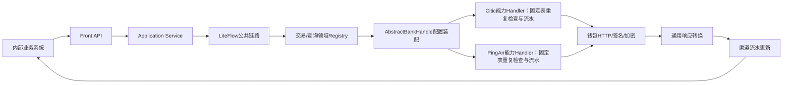

# SaaS 2.0 多银行渠道 Front Service 完整重构实施方案

> Wiki 入口：[WIKI-START.md](./WIKI-START.md)
> 状态：reference-plan（历史实施方案与映射参考）
> 创建日期：2026-08-03
> 适用范围：新多银行渠道支付 Front
> 参考项目：`fund-catering-front-service`
> 首期银行：中信、平安
> LiteFlow 基线：跟随当前工程 `2.12.1`

> 后续代码开发硬约束：[05-front代码开发约束.md](./05-front代码开发约束.md)
>
> 本文中的阶段勾选、“当前大 Handle”及“尚未实现”等描述是历史过程记录，不代表当前工作区。
> 当前状态只以 [WIKI-START.md](./WIKI-START.md)、
> [12-front-implementation-issues/README.md](./12-front-implementation-issues/README.md) 和当前代码为准。

---

## 1. 结论与完整性判断

### 1.1 现有方案是否可行

可行。

旧 `fund-catering-front-service` 的以下结构可以继续参考：

```text
API/Controller
  → Application Service
  → Router
  → 银行 Handle
  → 钱包 HTTP 客户端
```

但新项目只参考技术结构，不兼容旧请求对象、旧配置定位方式、旧返回对象和旧数据库结构。

### 1.2 当前记忆体文档是否足够直接开发

在本文档补充前，现有文档只达到“总体架构可讨论、银行能力可继续核对”的程度，还不能直接让开发 AI 一次生成完整工程，缺少：

1. 确定的 Maven 模块和 package 结构；
2. 类级别职责和依赖方向；
3. 完整 API、请求、响应、枚举清单；
4. LiteFlow 上下文、节点、链路和异常收口方式；
5. Router 注册方式与重复实现校验；
6. 渠道流水 DDL、重复交易规则和状态迁移；
7. 配置系统适配端口；
8. 中信、平安 Handle 骨架及未接入行为；
9. 测试边界和可验证的完成标准。

本文档补齐上述内容后，开发 AI 可以一次性完成：

- 新工程骨架；
- API 契约和公共业务对象；
- Controller、Application Service；
- LiteFlow 公共编排；
- Router、Handle SPI 和注册表；
- 租户配置端口和内部配置模型；
- 渠道流水、重复交易检查、状态机；
- 公共 HTTP、日志脱敏、异常处理骨架；
- 中信、平安 Handle 空实现骨架；
- 非银行协议相关单元测试和集成测试。

开发 AI 不能在没有逐接口确认的情况下完成：

- 银行请求 DTO 的最终字段；
- `specialData` 到钱包 `reserve` 的最终映射；
- 银行响应到通用响应的最终映射；
- 每个接口的 `bizFunc/channelNo/path` 最终配置；
- 中信、平安签名、加密、验签的生产实现；
- 银行特殊状态码的最终归一化；
- 配置系统真实接口尚未确定时的生产适配器。

因此，“一次性做完”的准确边界是：

```text
一次完成公共框架、业务契约、流程、路由、流水、测试和银行骨架；
逐接口补充中信/平安 Handle 内的银行协议实现。
```

---

## 2. 建设目标与非目标

### 2.1 建设目标

新 Front 面向内部供应链等业务系统，提供统一多银行钱包能力：

1. 业务系统只理解 Front 业务对象，不理解钱包报文；
2. Front 根据 `tenantId + platformCode` 获取银行配置；
3. Router 根据 `platformCode` 选择中信或平安 Handle；
4. Handle 决定钱包接口、`bizFunc`、`channelNo` 和银行字段；
5. 交易类请求建立 Front 渠道流水；
6. 不同银行响应转换成 Front 通用对象；
7. 不支持和未接入能力必须明确返回错误，禁止返回 `null` 或模拟成功；
8. 后续增加银行时，不修改公共租户配置 Java 类和既有银行 Handle。

### 2.2 非目标

- 不兼容旧 `operator/orgCode/firstCode` 配置定位模式；
- 不接受业务系统传入银行密钥、URL、商户号和算法；
- 不允许调用方指定 `bizFunc/channelNo`；
- 不将所有银行特殊字段堆入一个公共配置对象；
- Registry Key 只使用类型安全的 `(BankCode, FrontCapability)`，不加入银行接口类型、账户类型、交易类型、
  `bizFunc` 或物理表名；
- 不让 LiteFlow 规则直接承担银行协议分派；
- 首期不实现开户、绑卡、销户、文件查询、充值和批量交易。

---

## 3. 技术基线与默认实施变量

为保证开发 AI 可以直接执行，未另行指定时使用以下默认值：

| 项目 | 默认值 |
|---|---|
| Java | 17 |
| Spring Boot | 3.5.15 |
| Spring Cloud | 2025.0.3 |
| LiteFlow | 2.12.1，跟随当前 `cateringsass` 工程 |
| ORM | MyBatis Plus |
| JSON | Fastjson2 `JSONObject` |
| 数据库 | MySQL 8 兼容语法 |
| 金额 | `Long`，统一使用人民币分 |
| 中信编码 | `zxegj` |
| 平安编码 | `pajzb` |
| 默认币种 | `CNY` |
| 日期 | `yyyyMMdd` 字符串 |
| 时间 | `HHmmss` 字符串 |

当前工程名：

```text
catering-modules/catering-front
```

当前基础包：

```text
com.chinaums.front
```

---

## 4. 首期完整业务能力

### 4.1 交易能力

| 能力编码 | 中文名称 | 是否记录渠道流水 | 银行 Handle 方法 |
|---|---|---:|---|
| `TRANSFER` | 普通转账 | 是 | `transfer` |
| `TRANSFER_AUTH` | 授权转账/短信鉴权转账 | 是 | `transferAuth` |
| `TRANSFER_AUTH_CODE_RESEND` | 授权码发送或重发 | 是，按授权码申请类型记录，敏感字段不落明文 | `resendTransferAuthCode` |
| `CONSUME` | 消费 | 是 | `consume` |
| `REFUND` | 退款 | 是 | `refund` |
| `WITHDRAW` | 提现 | 是 | `withdraw` |
| `PLATFORM_PAY` | 平台付款 | 是 | `platformPay` |
| `PLATFORM_RECEIVE` | 平台收款 | 是 | `platformReceive` |

说明：

- “授权转账”在当前文档中只确认了平安短信鉴权转账；不能写成真正的授信额度转账；
- 授权码发送和重发对外使用同一个接口；平安没有独立“重发”协议，重发时生成新的
  `transSsn/transTime` 并重新调用 `bizFunc=26`，不传原短信指令号；
- 消费和普通转账即使银行底层使用同一个接口，Front 仍保留不同能力编码；
- 平台收款和平台付款必须拆开，不能使用一个方向字段模糊表达；
- 平台付款、平台收款是中信专有能力；平安没有等价实现，Handle 固定返回 `UNSUPPORTED`。

### 4.2 查询能力

| 能力编码 | 中文名称 | 银行 Handle 方法 |
|---|---|---|
| `ACCOUNT_STATUS_QUERY` | 账户状态查询 | `queryAccountStatus` |
| `ACCOUNT_BALANCE_QUERY` | 账户余额查询 | `queryAccountBalance` |
| `TRANS_STATUS_QUERY` | 单笔交易状态查询 | `queryTransactionStatus` |
| `PLATFORM_TRANS_DETAIL_QUERY` | 平台交易明细查询 | `queryPlatformTransactionDetails` |
| `TRANS_DETAIL_QUERY` | 子账户/会员交易明细查询 | `queryTransactionDetails` |

账户余额查询通过核心字段 `accountScope` 区分：

```text
PLATFORM_FUNDS_ACCOUNT
USER_SUB_ACCOUNT
FUNCTIONAL_ACCOUNT
```

查询范围属于业务语义，必须位于强类型 `baseData`，不能放入 `specialData`。

虽然本轮用户列举时没有再次单独写出“交易状态查询”，首期仍必须保留该能力，用于交易超时、提现受理态
和 `UNKNOWN` 结果的主动查询确认；Front 不用它校验退款原业务交易。

---

## 5. 总体调用流程



交易标准链路：

```text
请求校验
→ 当前交易 API 内部固定 capability
→ Transaction Registry 按 (BankCode, capability) 选择能力 Handler
→ AbstractBankHandle按tenantId+bankCode装配配置上下文
→ 具体能力Handler使用固定Mapper执行重复交易检查
→ 生成frontSsn并创建渠道流水
→ Handler解析配置和specialData并调用钱包
→ 统一响应
→ 更新渠道流水
→ 返回
```

查询标准链路：

```text
请求校验
→ 当前查询 API 内部固定 capability
→ Query Registry 按 (BankCode, capability) 选择能力 Handler
→ AbstractBankHandle按tenantId+bankCode装配配置上下文
→ 具体能力Handler解析配置和specialData并调用银行查询接口
→ 统一查询响应
→ 返回
```

---

## 6. Maven 模块设计

复用工程既有 `catering-api-front`，不在 Front 业务模块下重复创建 API/Common：

```text
catering-api/
└── catering-api-front/

catering-modules/
└── catering-front/
    ├── pom.xml
    └── src/
```

### 6.1 `catering-api-front`

集中保存其他业务系统和 Front Service 编译期需要依赖的内容：

- Feign/API 接口；
- 对外请求对象；
- 对外响应对象；
- API 常量和业务枚举；
- Bean Validation 注解。

禁止放入：

- 银行请求和响应 DTO；
- 银行配置对象；
- Router、Handle；
- Mapper、Entity；
- 签名、加密和 HTTP 实现。

### 6.2 公共代码归属

不再建立独立 `catering-front-common`。API 接口签名使用的请求响应模型、常量和枚举进入
`catering-api-front`；统一返回主体 `R`、Front 公共错误码和 `FrontException` 进入
`catering-common-core`；流水号生成、校验、JSON 脱敏、异常转换等功能实现进入 `catering-front`
对应内部包。中信、平安钱包请求对象仍只能放在各银行适配器包中。

### 6.3 `catering-front`

保存所有运行时实现：

- Controller；
- Application Service；
- LiteFlow；
- Router、Handle SPI；
- 中信、平安适配器；
- 配置系统客户端；
- HTTP、签名、加密；
- 数据库实体、Mapper、Repository；
- 渠道流水和重复交易检查实现。

### 6.4 相对旧 `front-service` 的保留与优化

| 旧项目做法 | 新项目处理 |
|---|---|
| `api/common/service` 三模块 | API/Common 合并到既有 `catering-api-front`，运行时直接使用 `catering-front` 单模块 |
| Controller → Service → Router → Handle | 保留主调用层次 |
| 每个交易建立一个 Router | 按领域收敛为 Transaction/Query（后续 Account）Registry，领域内按银行 + capability 路由 |
| Router 使用 `BeanPostProcessor` 扫描 | 改为构造器注入能力 Handle 列表并创建不可变 Registry |
| Router Key 混入银行和账户类型 | 改为类型安全的 `(BankCode, FrontCapability)`；账户类型、bizFunc、表名不进 key |
| Handle 大量使用 `<T> T` 返回 | 改成明确请求和明确响应类型 |
| 中信、平安钱包 DTO 放入 common | 移入各自 `channel/{bank}/protocol` 包 |
| 使用旧平台结算配置对象 | 改为 `TenantBankConfigProvider`、通用账户配置对象和银行组装策略 |
| `reserveMap` 字符串 Key 分散硬编码 | 改为版本化 `specialData` 契约和显式映射 |
| 部分银行方法返回 `null` 或模拟成功 | 改为 `UNSUPPORTED/PENDING_INTEGRATION` 明确错误 |
| 没有 Front 渠道交易流水 | 按银行、交易业务拆表，并新增重复交易检查和状态机 |

---

## 7. 完整 package 结构

```text
catering-api/catering-api-front
└─ com.chinaums.front
   ├─ api
   │  ├─ FrontTransApi
   │  ├─ FrontQueryApi
   │  └─ model
   │     ├─ request
   │     │  ├─ FrontRequest
   │     │  ├─ FrontBaseRequestData
   │     │  ├─ TransferBusinessData
   │     │  ├─ AuthTransferBusinessData
   │     │  ├─ TransferAuthCodeBusinessData
   │     │  ├─ ConsumeBusinessData
   │     │  ├─ RefundBusinessData
   │     │  ├─ WithdrawBusinessData
   │     │  ├─ PlatformTransferBusinessData
   │     │  ├─ AccountStatusQueryData
   │     │  ├─ AccountBalanceQueryData
   │     │  ├─ TransStatusQueryData
   │     │  └─ TransactionDetailQueryData
   │     ├─ response
   │     │  ├─ FrontBaseResult
   │     │  ├─ FrontTransResult
   │     │  ├─ AccountStatusResult
   │     │  ├─ AccountBalanceResult
   │     │  ├─ TransStatusResult
   │     │  ├─ TransactionDetailItem
   │     │  └─ FrontPageResult
   │     └─ enums
   │        ├─ BankCode
   │        ├─ FrontCapability
   │        ├─ FrontTransactionStatus
   │        ├─ AccountScope
   │        ├─ AccountStatus
   │        └─ TransDirection
catering-common/catering-common-core
└─ com.chinaums.common.core
   ├─ domain
   │  └─ R
   ├─ error
   │  └─ FrontErrorCode
   └─ exception
      └─ FrontException

catering-modules/catering-front
└─ com.chinaums.front
   ├─ controller
   ├─ application
   │  ├─ FrontTransApplicationService
   │  ├─ FrontQueryApplicationService
   │  └─ FrontFlowExecutor
   ├─ flow
   │  ├─ context
   │  │  ├─ FrontFlowContext
   │  │  ├─ FrontExecutionInfo
   │  │  └─ FrontExecutionStage
   │  └─ component
   │     ├─ FrontRequestValidateCmp
   │     ├─ FrontTransactionRouteCmp
   │     ├─ FrontQueryRouteCmp
   │     ├─ BankHandleContextPrepareCmp
   │     ├─ FrontTransferExecuteCmp
   │     ├─ FrontConsumeExecuteCmp
   │     ├─ FrontQueryAccountStatusExecuteCmp
   │     ├─ ... 其余 10 个具名业务执行组件
   │     └─ FrontResultNormalizeCmp
   ├─ route
   │  ├─ TransactionRouter
   │  ├─ QueryRouter
   │  ├─ TransactionHandleRegistry
   │  └─ QueryHandleRegistry
   ├─ handle
   │  ├─ BankHandle
   │  ├─ AbstractBankHandle
   │  ├─ BankTransHandle
   │  ├─ BankQueryHandle
   │  └─ BankExecutionMetadata
   ├─ context
   │  └─ BankRequestContext
   ├─ config
   │  ├─ TenantBankConfigProvider
   │  ├─ TenantBankAccountConfig
   │  ├─ RemoteTenantBankConfigProvider（待接入）
   │  └─ assemble
   │     ├─ BankAccountConfigAssembler
   │     ├─ AbstractBankAccountConfigAssembler
   │     ├─ BankAccountConfigAssemblerRouter
   │     ├─ CiticBankAccountConfigAssembler
   │     └─ PingAnBankAccountConfigAssembler
   ├─ reserve
   │  ├─ FrontSpecialDataContract
   │  ├─ FrontSpecialDataContractRegistry
   │  └─ FrontSpecialDataValidator
   ├─ record
   │  ├─ FrontChannelTransaction
   │  ├─ FrontChannelTransactionMapper
   │  ├─ FrontChannelTransactionRepository
   │  ├─ FrontTransactionRecordService
   │  └─ FrontDuplicateTransactionService
   ├─ channel
   │  ├─ citic
   │  │  ├─ CiticTransHandle
   │  │  ├─ CiticQueryHandle
   │  │  ├─ config（待接入）
   │  │  ├─ client（待接入）
   │  │  ├─ protocol/request（待接入）
   │  │  ├─ protocol/response（待接入）
   │  │  ├─ mapper（待接入）
   │  │  └─ crypto（待接入）
   │  └─ pingan
   │     ├─ PingAnTransHandle
   │     ├─ PingAnQueryHandle
   │     ├─ config（待接入）
   │     ├─ client（待接入）
   │     ├─ protocol/request（待接入）
   │     ├─ protocol/response（待接入）
   │     ├─ mapper（待接入）
   │     └─ crypto（待接入）
   └─ infrastructure
      ├─ configclient
      ├─ http
      ├─ crypto
      ├─ persistence
      └─ logging
```

资源目录：

```text
src/main/resources/
├─ bootstrap.yml
├─ liteflow/front-flow.xml
├─ mapper/{bank}/{business}TransactionMapper.xml（待接入）
└─ db/migration/V001__create_front_bank_business_transaction_tables.sql
```

---

## 8. 对外 API 设计

### 8.1 请求外壳

保持用户已确认的两段式结构：

```java
public class FrontRequest<T extends FrontBaseRequestData> {
    private T baseData;
    private JSONObject specialData;
}
```

```java
public class FrontBaseRequestData {
    private String tenantId;
    private String storeId;
    private BankCode platformCode;
}
```

`accountConfig` 不允许由业务系统传入。Front 加载配置后放入内部上下文。

以中信普通转账为例，请求 JSON 固定为两个顶层字段：

```json
{
  "baseData": {
    "tenantId": "tenant-001",
    "storeId": "store-001",
    "platformCode": "zxegj",
    "bizRequestNo": "request-001",
    "bizOrderNo": "order-001",
    "amount": 100,
    "currency": "CNY"
  },
  "specialData": {
    "outAcctNo": "payer-001",
    "inAcctNo": "payee-001",
    "USER_D_NM": "付款方名称",
    "USER_C_NM": "收款方名称"
  }
}
```

其中 `platformCode` 当前取值为中信 `zxegj`、平安 `pajzb`。`specialData` 的内部字段由“银行 + 接口”
共同约定；协议尚未确认时允许为空对象，但不允许把银行私有字段提升到 `baseData`。

### 8.2 交易 API

```text
POST /front/v1/transactions/transfer
POST /front/v1/transactions/transfer/auth
POST /front/v1/transactions/transfer/auth-code/resend
POST /front/v1/transactions/consume
POST /front/v1/transactions/refund
POST /front/v1/transactions/withdraw
POST /front/v1/transactions/platform-pay
POST /front/v1/transactions/platform-receive
```

普通交易统一返回：

```java
R<FrontTransResult>
```

授权码发送或重发返回：

```java
R<FrontTransferAuthCodeResult>
```

### 8.3 查询 API

```text
POST /front/v1/queries/accounts/status
POST /front/v1/queries/accounts/balance
POST /front/v1/queries/transactions/status
POST /front/v1/queries/transactions/platform-details
POST /front/v1/queries/transactions/details
```

每个 API 在服务内部直接确定 `FrontCapability`，调用方不在请求里传 `QueryCapability/FrontCapability`。
API 所属领域先确定 Transaction/Query（后续 Account）Registry，Registry 再以
`(BankCode, FrontCapability)` 精确定位能力 Handler；该枚举值同时用于日志和渠道流水记录，但不得用于
猜测领域、统一能力预校验或公共 Dispatch `switch`。

### 8.4 通用响应约束

单条交易、交易状态和账户查询使用工程公共 `R` 包装具体结果：

```java
R<具体结果>
```

`R.code/msg` 表达工程统一调用结果，`R.data` 是确定类型的 Front 结果。所有结果继承统一基础结果：

```java
public class FrontBaseResult {
    private String frontRespCode;
    private String frontRespDesc;
    private JSONObject specialData;
}
```

响应 `data` 的强类型字段保存跨银行统一结果及 Front 响应码，`data.specialData` 保存当前银行和接口的特殊返回。
分页明细查询直接返回工程统一的 `TableDataInfo<TransactionDetailItem>`，禁止再使用 `R` 包装。
每个 API 方法必须固定具体结果类型；禁止增加 `FrontResponse` 中间层，也禁止复用旧 Handle 的任意 `<T> T`。

未接入能力的响应示例：

```json
{
  "code": 500,
  "msg": "银行适配器尚未完成接入",
  "data": {
    "frontRespCode": "F200003",
    "frontRespDesc": "银行适配器尚未完成接入",
    "specialData": {}
  }
}
```

`R` 只用于单条接口。分页明细查询的成功和业务失败直接通过
`FrontPageResult.frontRespCode/frontRespDesc/specialData` 表达，失败时 `records` 返回空集合。

交易结果保留已确认字段：

```java
public class FrontTransResult extends FrontBaseResult {
    private String frontSsn;
    private FrontTransactionStatus frontStatus;
    private String frontQueryId;
    private String frontRemark;
    private String frontTransDate;
    private String frontTransTime;
}
```

查询不复用交易结果对象，分别定义账户状态、账户余额、交易状态和明细分页结果。

---

## 9. 核心业务对象最低字段

### 9.1 资金交易公共字段

每个交易 DTO 至少包含：

```text
bizRequestNo       业务调用标识，不参与本期重复交易键
bizOrderNo         业务主订单号
bizSubOrderNo      业务子订单号，可空
payStoreNo         付款业务门店编码
payStoreId         付款业务门店 ID
recStoreNo         收款业务门店编码
recStoreId         收款业务门店 ID
amount             Long，人民币分
currency           默认CNY
businessDate       yyyyMMdd
businessTime       HHmmss
remark             业务备注
```

各交易补充：

| DTO | 主要补充字段 |
|---|---|
| `TransferBusinessData` | 只继承内部交易公共字段；收付款账户、会员和名称放请求 `specialData` |
| `AuthTransferBusinessData` | 继承普通转账字段；账户、会员、姓名、短信指令号和验证码放请求 `specialData` |
| `TransferAuthCodeBusinessData` | 只保留内部交易公共字段；付款账户、付款会员编号、收款账户放请求 `specialData` |
| `ConsumeBusinessData` | 内部交易公共字段、消费场景、订单信息；银行账户字段放请求 `specialData` |
| `RefundBusinessData` | 原 `frontSsn`、原业务主/子订单、退款金额、手续费、退款原因 |
| `WithdrawBusinessData` | 内部交易公共字段；提现账户、会员、银行卡、账户名称、持卡人名称放请求 `specialData` |
| `PlatformTransferBusinessData` | 内部交易公共字段；用户侧账户和名称放请求 `specialData`，平台侧登记簿隐式确定 |

银行特有但不具备公共业务语义的字段留在 `specialData`，不得为迁就某家银行污染公共 DTO。

### 9.2 查询公共字段

账户状态：

```text
baseData：无银行账户字段
specialData：银行协议账户 key，例如中信 acctNo
```

账户余额：

```text
accountScope
specialData：银行协议账户 key；银行专用功能账户类型也放 specialData
```

交易状态：

```text
frontSsn（优先）
bizOrderNo（业务主流水号）
bizSubOrderNo（业务子流水号）
```

平台交易明细和交易明细：

```text
pageNo
pageSize
specialData：交易明细账户标识（非平台明细时必填）及银行专用查询条件
```

交易、交易查询和账户查询的请求均保留 `FrontRequest.specialData`，由业务系统组装，具体银行 Handle
按当前具体 Handle 方法的契约解析并映射到银行请求 `reserveMap`。账户查询的 `accountScope` 仍是公共强类型条件；
交易明细的日期范围、交易类型和银行账户/登记簿类型属于“银行 + 查询能力”筛选条件，放入
`specialData`。中信字段规则以 [10-transaction-query-field-contract](10-transaction-query-field-contract.md)
为准。中信协议没有请求方向筛选字段，`direction` 当前不进入明细请求对象，避免分页后再过滤导致结果错误。

单笔交易状态查询返回一个 `TransStatusResult.specialData`；两个明细查询除分页结果自身继承的
查询级 `specialData` 外，每条 `TransactionDetailItem` 还必须包含独立 `specialData`，用于承载该笔银行返回的
`reserveMap` 映射结果。

---

## 10. 内部执行上下文

API 层保留泛型，LiteFlow 内部使用单一非泛型上下文，避免运行期泛型擦除和大量强制转换散落在组件中：

```java
public class FrontFlowContext {
    private FrontCapability capability;
    private Object baseData;
    private TenantBankAccountConfig accountConfig;
    private JSONObject specialData;
    private FrontBaseResult result;
    private FrontExecutionInfo executionInfo;
    private Throwable failure;
}
```

`FrontFlowContext.capability` 由当前 API 方法固定写入，不接受调用方输入；它用于对应领域 Registry 的
`(BankCode, FrontCapability)` 精确路由、日志定位和渠道流水记录。不得根据 capability 名称选择领域，
不得执行统一能力预校验，也不得在公共 Dispatch 中再次选择具体 Handle 方法。

上下文提供受控类型读取方法：

```java
<T> T requireBaseData(Class<T> type)
<R> R requireResult(Class<R> type)
```

当前 `FrontExecutionInfo` 已包含：

```text
frontSsn
interfaceCode
receivedAt
sendStartedAt
sendCompletedAt
executionStage
```

`FrontChannelTransaction` 和银行执行元数据将在渠道流水和真实银行协议接入时增加，不使用无约束
`Object/JSONObject` 提前占位。`FrontFlowContext` 是 LiteFlow 后续使用的已初始化业务 Context；
项目基线为 LiteFlow 2.12.1，后续执行时传入该实例，不继承 LiteFlow 内部 Slot。

---

## 11. Router 与 Handle 设计

### 11.1 领域 Registry 与 Key

API/应用服务直接确定业务领域，交易、查询和后续账户使用独立 Registry：

```text
TransactionHandlerRegistry.route(bankCode, capability)
QueryHandlerRegistry.route(bankCode, capability)
AccountHandlerRegistry.route(bankCode, capability)   # 后续账户维护能力启用时增加
```

首期“账户状态、账户余额”属于查询，因此进入 Query Registry；后续开户、绑卡、信息变更、销户等账户
维护能力进入独立 Account Registry，不修改交易和查询路由。

领域 Registry 的唯一 key 固定为类型安全的：

```text
(BankCode, FrontCapability)
```

`BankCode` 由 `platformCode` 统一解析，capability 由具体 API 方法内部固定。禁止把 `bizFunc`、
`accountType`、银行交易类型或物理表名混入 key，也禁止根据 capability 名称或前缀反推领域。

### 11.2 Registry 注册

旧项目使用 `BeanPostProcessor` 扫描 Handle。新项目使用 Spring 构造器注入当前领域的能力 Handler 列表，
建立不可变复合键 Map：

```java
public TransactionHandlerRegistry(List<TransactionCapabilityHandler> handlers) {
    // 按 (bankCode, capability) 构建不可变 Map；重复 key 立即启动失败
}
```

注册约束：

- 不实现自定义 `BeanPostProcessor`，不在 Bean 初始化回调中隐式修改路由表；
- 同一银行可注册多个 capability，同一 `(BankCode, FrontCapability)` 只能有一个 Handler；
- `BankCode` 无法解析或银行整体未接入返回 `BANK_NOT_SUPPORTED`；
- 银行已接入但未注册当前 capability 返回 `CAPABILITY_NOT_SUPPORTED`；
- Registry 真实存在的复合键是唯一能力支持事实来源，不再建立能力状态表。

### 11.3 单能力 Handler SPI

```java
public interface BankCapabilityHandler {
    BankCode bankCode();
    FrontCapability capability();
    FrontBaseResult execute(FrontFlowContext context);
}
```

Transaction/Query 可分别定义受限子接口，但一个 Handler 只对应一个“银行 + capability”，不得在 Handler
内部再维护 capability switch。已确认但暂未联调的能力可注册待接入 Handler，在 `execute` 入口返回或抛出
`ADAPTER_NOT_READY`；完全不支持的银行能力不注册，由 Registry 返回 `CAPABILITY_NOT_SUPPORTED`。

`BankRequestContext<T>` 是只在 Handle 内部使用的三段式上下文：

```text
baseData
specialData
accountConfig: TenantBankAccountConfig
```

对外 `FrontRequest<T>` 仍固定为 `baseData + specialData` 两段。`accountConfig` 由
`AbstractBankHandle.prepareContext()` 使用 `tenantId + bankCode` 查询并装配，不由调用方传入。
当前 Application Service 已调用 `FrontFlowContext.from(request, capability)` 完成
`FrontRequest → 统一业务 Slot` 转换，并在路由、配置装配、分派、完成和失败时维护阶段。
LiteFlow `FlowExecutor`、NodeComponent 和 EL 规则链已经接入；当前按两种模板定义 13 条具名链。
渠道流水写入和状态更新已经下沉到具体交易 Handle，不再设置独立持久化节点。

当前代码中的公共 `FrontTransactionDispatchNode/FrontQueryDispatchNode` 仍按 `capability` 二次选择
大 Handle 方法，与本文最新目标不一致；按 `FRONT-P2-006` 待改为领域 Registry 使用
`(BankCode, FrontCapability)` 返回单能力 Handler，通用执行节点只调用已选 Handler。

### 11.4 Handle 职责边界

Handle 必须完成：

1. 由当前被调用的明确方法直接执行；未覆盖方法使用 SPI 默认“不支持”结果；
2. 由统一父类加载并校验租户银行配置，装配 `BankRequestContext`；
3. 使用当前业务固定 Mapper 执行重复交易检查；
4. 解析当前能力的 `specialData`；
5. 从 `accountConfig` 读取通用账户配置及当前银行 `accountSpecialData`；
6. 确定 `channelNo/bizFunc/path`；
7. 组装钱包请求及 `reserve`；
8. 写入 INIT 并更新为 SENDING；
9. 触发签名、加密和 HTTP 调用；
10. 判断钱包受理、银行响应和交易终态，并更新渠道流水；
11. 转换 Front 通用结果。

能力 Handler 不负责：

- 在各个中信、平安具体 Handler 中重复实现远程配置查询；
- Controller 参数绑定；
- 直接修改业务系统订单。

### 11.5 日志要求

基础框架必须记录：

- 应用启动时每个 `(BankCode, FrontCapability)` 能力 Handler 的注册结果；
- 重复复合键、未找到银行或未找到银行能力时的明确错误日志；
- 每次请求的 `tenantId`、`storeId`、`platformCode`、`capability`；capability 同时是领域 Registry 路由键
  的一部分和业务定位字段；
- Registry 最终选择的能力 Handler；
- 被调用的具体 Handler 及“不支持/待接入”结果；
- 成功或失败结果、Front 错误码、处理耗时、异常阶段和必要的关联流水号；
- 后续银行调用的发送开始、响应到达、耗时和归一化状态。

禁止直接记录完整 `specialData`、租户银行配置、密钥、完整卡号、手机号、证件号和短信验证码。
如需记录银行特殊字段，必须先通过契约白名单和脱敏器。

### 11.6 当前 Handle 方法与旧 Front Handle 映射

本节以以下两个旧项目为参照：

```text
/Users/limeng/workspaces/IdeaProjects_lsym_dep/slhy/fund-catering/fund-catering-front
/Users/limeng/workspaces/IdeaProjects_mdl_dep/mdl/fund-catering-front
```

中信退款另以最新实现为参考：

```text
/Users/limeng/workspaces/IdeaProjects_lsym_uat/slhy
branch: lsym_20260625_limeng_refundTask
commit: 3dff8255d6
```

两个旧项目的交易和交易查询 Handle 接口基本一致；账户状态方法存在分支差异，详见下文。

#### 11.6.1 公共方法

| 当前 `BankHandle` 方法 | 旧 Front 方法 | 处理方式 |
|---|---|---|
| `bankCode()` | `getPlatformCode()` | 保留银行定位语义，类型改为新的 `BankCode` |
| `prepareContext(request)` | 无直接对应 | 新增，由统一父类按 `tenantId + bankCode` 加载配置并形成三段式 Handle 上下文 |
| 无直接方法 | `getLockTimeOut()` | 后续进入配置或执行策略，不作为 Handle 路由方法 |
| 无直接方法 | `getSupportAccountType()` | 后续由请求、能力矩阵或租户银行配置决定 |
| 无直接方法 | `getMode()` | 后续进入银行配置，不进入 Router Key |

#### 11.6.2 交易方法

| 当前 `BankTransHandle` | 旧 Front Handle 方法 | 映射说明 |
|---|---|---|
| `transfer()` | `BasTransTransferHandle.transTransfer()` | 一对一，普通转账 |
| `transferAuth()` | `BasTransTransferHandle.transTransferAuth()` | 一对一；仅平安为真实短信鉴权转账，中信旧实现只是挡板成功 |
| `resendTransferAuthCode()` | `BasTransSendVerificationHandle.sendSmsVerification()` | 语义对应；仅平安真实调用验证码申请接口，中信旧实现只是模拟成功；首次发送与重发复用同一 Front 方法 |
| `consume()` | `BasTransConsumeHandle.transConsume()` | 一对一，消费 |
| `refund()` | `BasTransConsumeCancelHandle.transConsumeCancel()` | 语义重命名为真退款；中信不得复制旧反向转账实现 |
| `withdraw()` | `BasTransWithDrawHandle.transWithDraw()` | 一对一，提现 |
| `platformPay()` | `BasTransTransferHandle.platformPay()` | 一对一，平台付款 |
| `platformReceive()` | `BasTransTransferHandle.platformReceive()` | 一对一，平台收款 |

#### 11.6.3 查询方法

| 当前 `BankQueryHandle` | 旧 Front Handle 方法 | 映射说明 |
|---|---|---|
| `queryAccountStatus()` | `AccountHandle.acctState()` | 账户状态查询；该方法存在于 lsym 版本，mdl 版本的 `AccountHandle` 接口中没有 |
| `queryAccountBalance()` | `BasTransQueryHandle.queryAccInfo()` | 从旧“账户信息”能力中收敛出账户余额查询 |
| `queryTransactionStatus()` | `queryTransStatus()` | 单笔交易状态；中信固定映射 `bizFunc=74`，不得合并文件状态 `73` |
| `queryPlatformTransactionDetails()` | `queryPlatformTransPages()` | 中信映射交易资金账户明细 `bizFunc=25/chnlNo=0010`；不按交易类型拆方法 |
| `queryTransactionDetails()` | `queryTransPages()` + `queryWithDrawFee()` 的协议参考 | 中信统一映射登记簿明细 `bizFunc=24/chnlNo=0010`；手续费等由 specialData 交易类型筛选 |

`queryTransStatus_73()` 不再单独暴露，不属于能力遗漏。中信 `73` 是文件处理状态查询，后续若纳入必须
设计明确的文件查询 API，不能作为 `queryTransactionStatus()` 的协议分支。

#### 11.6.4 首期未纳入的旧方法

以下旧方法没有映射到本期 13 个 API：

- `transTransferRecall()`：转账召回或交易回溯；
- `sendCodeVerification()`：旧代码未形成稳定对外入口；
- `queryWithDrawFee()`：不再新增独立 API，由平台明细/账户交易查询通过交易类型筛选覆盖；
- `queryReceiptVerify()`：旧代码仅平安有真实实现，中信返回 `null`；实际语义是查询明细单验证码，若后续纳入应改为 `queryDetailCheckCode()` 或 `queryReceiptCheckCode()`，并作为平安特有能力单独设计；
- `bindCard/whiteName/openAccount/unBindCard/updateAccountInfo/acctClose/depositReg`：账户维护能力；
- `BasFileProcessHandle` 下的文件上传、下载和对账文件能力。

除已确认由现有查询覆盖的提现手续费外，其余能力后续必须经过业务范围确认后再增加明确 API，
不放入 `specialData` 伪装成现有能力。中信的电子回执文件下载与平安的明细单验证码不是同一能力。

#### 11.6.5 当前银行实现方式

| 当前实现类 | 业务方法来源 | 当前职责 |
|---|---|---|
| `CiticTransHandle` | `AbstractBankHandle` + `BankTransHandle` 的 8 个交易方法 | 复用配置装配并覆盖中信支持的交易方法，未覆盖方法返回能力不支持 |
| `PingAnTransHandle` | `AbstractBankHandle` + `BankTransHandle` 的 8 个交易方法 | 复用配置装配并覆盖平安支持的交易方法，未覆盖方法返回能力不支持 |
| `CiticQueryHandle` | `AbstractBankHandle` + `BankQueryHandle` 的 5 个查询方法 | 复用配置装配并覆盖中信查询方法 |
| `PingAnQueryHandle` | `AbstractBankHandle` + `BankQueryHandle` 的 5 个查询方法 | 保留待核对草稿，公开方法当前直接报待接入 |

银行字段确认后，在上述具体银行类中覆盖对应的强类型方法。旧项目任意 `<T> T` 返回不再复用，
改为每个 API 固定 `R<具体结果>`；Handle 内部直接返回确定类型的 `FrontBaseResult` 子类，
银行差异继续通过具体结果的 `specialData` 返回。

#### 11.6.6 当前 Handle 实际目录结构

当前已经创建的 Handle 契约、统一父类、上下文和四个银行实现类位置如下：

```text
com.chinaums.front
├─ handle
│  ├─ BankHandle.java
│  ├─ AbstractBankHandle.java
│  ├─ BankTransHandle.java
│  └─ BankQueryHandle.java
├─ context
│  └─ BankRequestContext.java
├─ config
│  ├─ TenantBankConfigProvider.java
│  ├─ TenantBankAccountConfig.java
│  └─ assemble
│     ├─ BankAccountConfigAssembler.java
│     ├─ AbstractBankAccountConfigAssembler.java
│     ├─ BankAccountConfigAssemblerRouter.java
│     ├─ CiticBankAccountConfigAssembler.java
│     └─ PingAnBankAccountConfigAssembler.java
└─ channel
   ├─ citic
   │  ├─ CiticTransHandle.java
   │  └─ CiticQueryHandle.java
   └─ pingan
      ├─ PingAnTransHandle.java
      └─ PingAnQueryHandle.java
```

`channel/{bank}` 下暂不再增加一层 `handle` 目录，银行 Handle 实现类直接放在银行根包。
后续确认银行协议后，再在同级增加 `config/client/protocol/mapper/crypto` 子目录。

当前四个银行实现类覆盖各自已支持的强类型方法；`prepareContext()` 由 `AbstractBankHandle` 统一实现。
SPI 默认方法返回 `CAPABILITY_NOT_SUPPORTED`，平安五个待人工核对的查询方法由 Handle 直接报
`ADAPTER_NOT_READY`，禁止进入查询草稿。

#### 11.6.7 新 Handle 与参考实现类关联

本节的 `Zx` 对应新 Front 的中信 `CITIC`，`Pa` 对应平安 `PING_AN`。默认参考 mdl 下列目录；
中信 `refund` 单独使用前文列出的最新 lsym UAT 分支：

```text
fund-catering-front-service/src/main/java/com/chinaums/erp/slhy/catering/front
├─ service/impl
├─ service/impl/zx
├─ service/impl/pa
├─ handle/impl/zx
└─ handle/impl/pa
```

新 Front 按银行聚合参考项目的细粒度实现：

```text
CiticTransHandle
  ← ZxTransTransferHandle
  ← ZxTransSendVerificationHandle
  ← ZxTransConsumeHandle
  ← ZxTransConsumeCancelHandle
  ← ZxTransWithDrawHandle

PingAnTransHandle
  ← PaTransTransferHandle
  ← PaTransSendVerificationHandle
  ← PaTransConsumeHandle
  ← PaTransConsumeCancelHandle
  ← PaTransWithDrawHandle

CiticQueryHandle
  ← ZxTransQueryHandle
  ← ZxTransQueryServiceImpl（银行专用平台明细入口）

PingAnQueryHandle
  ← PaTransQueryHandle
  ← PaTransQueryServiceImpl（银行专用平台明细入口）
```

##### 11.6.7.1 交易方法关联

| 新 `BankTransHandle` | 参考 API / Service | 参考 Handle 方法 | 中信参考类 | 平安参考类 | 实现状态 |
|---|---|---|---|---|---|
| `transfer()` | `FrontTransConsumeFacadeApi.transTransfer()` → `TransConsumeServiceImpl.transTransfer()` | `BasTransTransferHandle.transTransfer()` | `ZxTransTransferHandle` | `PaTransTransferHandle` | 两家均有真实实现 |
| `transferAuth()` | `FrontTransConsumeFacadeApi.transTransferAuth()` → `TransConsumeServiceImpl.transTransferAuth()` | `BasTransTransferHandle.transTransferAuth()` | `ZxTransTransferHandle` 只构造本地挡板成功，不调用中信 | `PaTransTransferHandle.transTransferAuth()` 真实调用 `/transfer` | 仅平安真实支持；中信必须 `UNSUPPORTED` |
| `resendTransferAuthCode()` | `FrontTransVerificationFacadeApi.sendSmsVerification()` → `TransVerificationServiceImpl.sendSmsVerification()` | `BasTransSendVerificationHandle.sendSmsVerification()` | `ZxTransSendVerificationHandle` 只构造模拟手机号和验证码 | `PaTransSendVerificationHandle.sendSmsVerification()` 真实调用 `/gen-auth-code` | 仅平安真实支持；重发与首次发送使用同一银行接口 |
| `consume()` | `FrontTransConsumeFacadeApi.transConsume()` → `TransConsumeServiceImpl.transConsume()` | `BasTransConsumeHandle.transConsume()` | `ZxTransConsumeHandle` | `PaTransConsumeHandle` | 两家均有真实实现 |
| `refund()` | `FrontTransConsumeFacadeApi.transConsumeCancel()` → `TransConsumeServiceImpl.transConsumeCancel()` | `BasTransConsumeCancelHandle.transConsumeCancel()` | 旧 mdl 使用 `zxTransfer/bizFunc=27`；最新 lsym UAT `ZxTransConsumeCancelHandle` 已使用 `ZxRefundRequest + zxRefund/bizFunc=23` | `PaTransConsumeCancelHandle` 调用 `/refund/bizFunc=02` | 两家均有真退款参考；中信以最新 lsym UAT 字段为准，原业务主子流水在 baseData 提供，其他原交易协议字段由请求 specialData 显式提供，Front 不查询原渠道表补齐 |
| `withdraw()` | `FrontTransConsumeFacadeApi.transWithDraw()` → `TransConsumeServiceImpl.transWithDraw()` | `BasTransWithDrawHandle.transWithDraw()` | `ZxTransWithDrawHandle` | `PaTransWithDrawHandle` | 两家均有真实实现 |
| `platformPay()` | `FrontTransConsumeFacadeApi.platformPay()` → `TransConsumeServiceImpl.platformPay()` | `BasTransTransferHandle.platformPay()` | `ZxTransTransferHandle`，`bizFunc=2041` | `PaTransTransferHandle` 继承 `AbstractTransTransferHandle` | 中信真实实现；平安父类返回 `null` 证明无实现，新 Front 固定 `UNSUPPORTED` |
| `platformReceive()` | `FrontTransConsumeFacadeApi.platformReceive()` → `TransConsumeServiceImpl.platformReceive()` | `BasTransTransferHandle.platformReceive()` | `ZxTransTransferHandle`，`bizFunc=2042` | `PaTransTransferHandle` 继承 `AbstractTransTransferHandle` | 中信真实实现；平安父类返回 `null` 证明无实现，新 Front 固定 `UNSUPPORTED` |

##### 11.6.7.2 交易查询方法关联

| 新 `BankQueryHandle` | mdl API / Service | mdl Handle 方法 | mdl 中信具体类 | mdl 平安具体类 | mdl 实现状态 |
|---|---|---|---|---|---|
| `queryAccountStatus()` | mdl 无对应 API / Service | mdl `AccountHandle` 没有 `acctState()` | 无 | 无 | mdl 分支没有账户状态查询实现；不能从 mdl 复制 |
| `queryAccountBalance()` | `FrontTransQueryFacadeApi.queryAccInfo()` → `TransQueryServiceImpl.queryAccInfo()` | `BasTransQueryHandle.queryAccInfo()` | `ZxTransQueryHandle` | `PaTransQueryHandle` | 两家均有真实实现 |
| `queryTransactionStatus()` | `FrontTransQueryFacadeApi` → `TransQueryServiceImpl.queryTransStatusQuery()` | `queryTransStatus()` | `ZxTransQueryHandle` | `PaTransQueryHandle` | 两家均有单笔状态实现；中信使用 `74`，`queryTransStatus_73()` 是文件状态，不纳入本方法 |
| `queryPlatformTransactionDetails()` | 通用入口 `TransQueryServiceImpl.queryPlatformTransPages()`；银行专用入口 `ZxTransQueryServiceImpl/PaTransQueryServiceImpl.queryPlatformTransPages()` | `BasTransQueryHandle.queryPlatformTransPages()` | `ZxTransQueryHandle`；另有 `ZxTransQueryServiceImpl`，中信 `25/0010` | `PaTransQueryHandle`；另有 `PaTransQueryServiceImpl` | 中信通用 Handle 和专用 Service 均有实现；平安通用 Handle 返回 `null`，真实实现位于专用 Service |
| `queryTransactionDetails()` | mdl 没有稳定统一 Facade | `queryTransPages()`；`queryWithDrawFee()` 提供中信 `24` 的真实协议参考 | `ZxTransQueryHandle` 中 `queryTransPages()` 返回 `null`，但 `queryWithDrawFee()` 和 UAT 示例真实调用 `24/0010` | `PaTransQueryHandle.queryTransPages()` 返回 `null` | 新中信方法统一使用 `24/0010`，交易类型和日期范围来自 specialData，不复制旧方法拆分 |

##### 11.6.7.3 未纳入方法的 mdl 实现状态

| mdl 方法 | 中信具体类 | 平安具体类 | 当前结论 |
|---|---|---|---|
| `queryWithDrawFee()` | `ZxTransQueryHandle` 有真实实现 | `PaTransQueryHandle` 返回 `null` | 不新增独立 API，由平台/账户交易明细按交易类型覆盖 |
| `queryReceiptVerify()` | `ZxTransQueryHandle` 返回 `null` | `PaTransQueryHandle` 有真实实现 | 仅平安真实支持，后续如纳入应作为平安特有“明细单验证码查询”能力设计 |

上述类只作为银行功能码、请求组装、调用和响应映射的参考。迁移到新 Front 时必须进入
`CiticTransHandle/CiticQueryHandle/PingAnTransHandle/PingAnQueryHandle` 的明确方法，
并改用新的 `BankRequestContext`、`TenantBankAccountConfig` 和确定类型 `FrontBaseResult` 子类；不得复制 mdl
混入账户类型/bizFunc 的旧复合路由键、任意 `<T> T`、配置定位方式或返回 `null` 行为。本项目规定的
类型安全 `(BankCode, FrontCapability)` 领域 Registry key 必须保留。

---

## 12. 租户银行配置设计

### 12.1 配置端口

```java
public interface TenantBankConfigProvider {
    TenantBankAccountConfig load(String tenantId, BankCode bankCode);
}
```

```java
public record TenantBankAccountConfig(
    String appId,
    String appKey,
    String url,
    String mchntId,
    String mchntMbrId,
    JSONObject accountSpecialData) {
}
```

真实 Provider 必须先通过配置查询接口读取 `support_bank_config`，按银行编码解析配置模板 key，
再在当前租户上下文中通过同一接口查询用户银行配置。不得硬编码具体银行模板 key，也不得引入
配置快照、假版本或无真实来源的启用状态。`configVersion/config_version` 已废弃，配置接口没有
真实版本来源，禁止在配置 Provider、执行上下文、日志、Entity 或 DDL 中恢复。

### 12.2 统一父类装配流程

各银行能力 Handler 统一复用 `AbstractBankHandle`，领域 Registry 完成“银行 + capability”精确路由后调用：

```text
AbstractBankHandle.prepareContext(request)
  → 校验 request.platformCode == handle.bankCode()
  → TenantBankConfigProvider.load(tenantId, bankCode)
  → 查询 support_bank_config，解析配置模板 key
  → 在当前 tenantId 上下文中查询用户银行配置
  → 校验并按银行白名单组装账户配置
  → BankRequestContext(baseData, specialData, accountConfig)
  → 具体银行业务方法
```

只允许注册一个 `TenantBankConfigProvider`。多个 Provider 立即启动失败；真实 Provider 尚未接入时
允许骨架启动，但任何标记为 `SUPPORTED` 并进入配置装配的能力必须明确失败，不能模拟配置或成功结果。

配置加载日志只记录 `tenantId/storeId/bankCode/configKey`、结果和耗时，不记录
`accountConfig/accountSpecialData` 内容。

### 12.3 账户配置通用对象与银行策略

```text
原始配置 JSONObject
  → BankAccountConfigAssemblerRouter(bankCode)
  → AbstractBankAccountConfigAssembler 组装通用字段
  → 平安/中信策略组装 accountSpecialData
  → TenantBankAccountConfig
```

账户通用强类型字段：

```text
appId
appKey
url
mchntId
mchntMbrId
```

账户特定静态配置放入独立 `accountSpecialData`：

| 银行 | `accountSpecialData` 字段 |
|---|---|
| 平安 | `txnClientNo`、`mrchCode`、`stlAcctNo`（资金汇总账号） |
| 中信 | `default_role`、`default_fund_type`、`self_role`、`self_fund_type`、`self_dealType`、`self_store_no`、`self_store_id` |

中信上述 7 个字段是中信各交易能力可复用的账户配置，但仍是银行特定字段，
不添加到跨银行通用对象。`transTime/transSsn` 按请求生成，`bizFunc` 由银行交易策略选择，
不属于账户配置。`bizFunc/chnlNo` 由具体银行 Handle 的业务方法使用固定常量写入银行请求；
`transTime` 在每次调用时生成，`transSsn` 由具体银行 Handle 按该银行规则生成并保存到渠道交易流水。

`specialData` 是当前交易/查询的银行特定动态参数；`accountSpecialData` 是租户银行账户的
特定静态配置。两者必须是不同的 `JSONObject`，禁止 `putAll`、共享引用、相互覆盖或透传。

`AbstractBankAccountConfigAssembler` 只负责通用字段；`CiticBankAccountConfigAssembler`、
`PingAnBankAccountConfigAssembler` 只负责各自的 `accountSpecialData`。策略路由构造器注入
`List<BankAccountConfigAssembler>`，同银行重复注册必须启动失败。字段 key 常量放在
`catering-common-core/com.chinaums.common.core.constant.front`：`FrontBankConfigQueryKeys` 保存
`support_bank_config` 配置查询原始 key；具体银行配置模板 key 由该配置动态返回；`FrontBankAccountConfigKeys`、
`PingAnBankAccountConfigKeys`、`CiticBankAccountConfigKeys` 分别保存通用、平安和中信
`JSONObject` 字段 key。查询 key 不在公共层绑定银行，最终映射由真实 Provider 显式确定。

### 12.4 必须校验

- `support_bank_config` 存在且包含当前银行编码的唯一模板 key 映射；
- 当前租户的模板 key 配置存在且内容非空；
- 当前银行策略已注册且唯一；
- 当前银行和能力必需的 `appId/appKey/url/mchntId` 等字段存在；
- 银行必需的 `accountSpecialData` 字段存在；
- 请求不能覆盖配置字段。

---

## 13. specialData 契约

transfer/consume 的中信、平安首版字段契约已经单独固化在
[06-transfer-consume字段契约](./06-transfer-consume字段契约.md)，并由
`CiticTransferContractKeys/PingAnTransferContractKeys/FrontBankResponseConstants` 提供代码常量。
钱包公共请求字段名由 `FrontBankRequestConstants` 集中提供。
本节继续约束其他能力及后续版本的通用机制。

推荐格式：

```json
{
  "schemaVersion": "1.0",
  "data": {}
}
```

契约唯一键：

```text
platformCode + 明确API/Handle方法 + schemaVersion
```

每个契约定义：

- 允许字段；
- 必填和条件必填；
- JSON 类型；
- 长度、格式、枚举；
- 敏感级别；
- 钱包目标字段；
- 日志和流水保存规则。

全局禁止字段：

```text
bizFunc
channelNo/chnlNo
mchntId
mchntMbrId
appIdBank
appKeyBank
baseUrl/urlBank
publicKey/privateKey
signAlgorithm
encryptAlgorithm
```

禁止执行：

```java
walletReserve.putAll(specialData);
```

必须逐字段显式映射。

---

## 14. LiteFlow 编排设计

### 14.1 使用边界

LiteFlow 只编排公共步骤。银行 + capability 精确路由由对应领域的 Java Registry 完成。

基于当前工程 `2.12.1`，按 8 个交易方法、5 个查询方法保留 13 条具名链。规则中不做银行判断；领域
Registry 按 `(BankCode, FrontCapability)` 选择能力 Handler。13 条链可以复用交易/查询通用执行节点，
执行节点只调用已选 Handler，不得再按 capability 二次分派，也不要求复制 13 个执行节点。

### 14.2 交易链

```text
chainFrontTransfer =
THEN(
  frontRequestValidate,
  frontTransactionRoute,
  bankHandleContextPrepare,
  frontTransactionExecute,
  frontResponseNormalize
)
```

其余 7 条交易链可以复用 `frontTransactionExecute`；Route 节点已按
`(BankCode, FrontCapability)` 选中具体交易能力 Handler，执行节点只调用其统一入口。重复交易检查及渠道
流水 INIT/SENDING/响应更新由具体能力 Handler 完成，不设置公共重复检查或独立流水节点。

### 14.3 查询链

```text
chainFrontQueryAccountStatus =
THEN(
  frontRequestValidate,
  frontQueryRoute,
  bankHandleContextPrepare,
  frontQueryExecute,
  frontResponseNormalize
)
```

其余 4 条查询链可以复用 `frontQueryExecute`；执行节点调用 Query Registry 已选中的能力 Handler。

### 14.4 异常收口

不要假设正常链路的最后一个节点一定会执行。异常按来源分两类收口：

**业务异常**（配置缺失、银行不支持、能力不支持、适配器未接入、`specialData` 校验失败、银行明确拒绝
等可预期业务失败）：节点内不抛异常，而是：

```text
1. 把 FrontErrorCode 的 code/msg 写入 FrontFlowContext Slot 的 frontRespCode/frontRespDesc；
2. 调用 this.setIsEnd(true) 中断流程（LiteFlow 视为用户主动结束，response.isSuccess 仍为 true）；
3. FrontFlowExecutor 执行后返回带统一错误码的结果，Application Service 检查 Slot，
   若已标记业务失败则返回 R.fail(message, FrontBaseResult)。
```

不设置统一能力预验证。Handle 默认方法直接返回能力不支持结果；具体 Handle 抛出的
`FrontException` 由当前具名链的业务执行节点捕获，写 Slot 后 `setIsEnd(true)`。

**系统级异常**（`NullPointerException`、数据库连接失败、JSON 解析异常等非业务错误）：直接 throw，
由 `FrontExceptionHandler` 统一收口，返回 `R.fail(INTERNAL_ERROR, FrontBaseResult)`，不向调用方
泄漏堆栈。

`R` 语义固定：只有 Front 业务成功时顶层 `R.code=200`；银行明确失败、钱包业务失败、路由或能力
失败时顶层也使用失败码，同时通过 `R.data.frontRespCode/frontRespDesc/frontStatus` 表达具体原因。

资金交易发生超时或无响应时仍禁止自动盲目重发，应进入 `UNKNOWN` 状态由交易状态查询确认；
`UNKNOWN` 也属于业务异常，由 Handle 节点写入 Slot 后 `setIsEnd`。

### 14.5 LiteFlow Context

组件统一使用 `FrontFlowContext`，不得为每个银行创建一套 Slot。银行配置和响应通过类型安全读取方法访问。

本节设计依据当前工程使用的 LiteFlow 2.12.1；不直接使用仅在更高版本确认过的新 API 或配置项。

---

## 15. 渠道交易流水与重复交易检查

### 15.1 分银行、分交易业务表设计

首期建立 10 张物理表：

```text
中信：
front_citic_transfer_transaction
front_citic_consume_transaction
front_citic_refund_transaction
front_citic_withdraw_transaction
front_citic_platform_pay_transaction
front_citic_platform_receive_transaction

平安：
front_pingan_transfer_transaction
front_pingan_consume_transaction
front_pingan_refund_transaction
front_pingan_withdraw_transaction
```

平安 `TRANSFER_AUTH/TRANSFER_AUTH_CODE_RESEND` 与 `TRANSFER` 共用平安转账表，由 `capability`
字段区分记录；三者分别以自己的 `(PING_AN, capability)` key 定位能力 Handler。capability 不参与统一
能力预校验或动态选表。中信不创建授权空表，平安不创建平台收付款空表。

调用链分两步：当前 API 固定 capability 并进入所属领域，Registry 按
`(BankCode, FrontCapability)` 选具体能力 Handler；该 Handler 使用自己的固定业务 Repository。禁止在
公共 Dispatch 或 Handler 内根据 capability 二次选方法/选表，也禁止接收物理表名或字符串拼接动态 SQL。

### 15.2 DDL 与业务关联基线

完整 DDL 不在母文档内重复，统一以以下两处为准：

```text
代码：catering-modules/catering-front/src/main/resources/db/migration/
      V001__create_front_bank_business_transaction_tables.sql
文档：docs/saas2.0 重构/09-channel-transaction-ddl.md
字段字典：docs/saas2.0 重构/09A-channel-transaction-table-field-catalog.md
```

每张表必须保留来源业务关联：

```text
biz_system_code
biz_transaction_type
biz_transaction_id
biz_sub_transaction_id
biz_request_no
biz_order_no
biz_sub_order_no
```

并保存金额、手续费、币种、收付款门店及账户/会员/姓名/卡号等明确字段，不保存整段
`baseData/specialData` 或银行报文快照。每张表统一包含 `reserve1/reserve2/reserve3` 三个 `VARCHAR(1024)` 临时扩展
字段。中信退款表只保存本次退款及银行请求、响应所需明确字段，不关联本地原转账或消费记录，
中信转账、消费表不维护累计退款金额；平安退款持久化边界仍按 `TODO-002` 等待确认。

不保存来源业务物理表名，不建立跨服务数据库外键。不保存密钥、验证码、支付密码和完整租户银行配置。
内部渠道表的账户、会员、姓名和卡号字段本期不要求数据库加密，但禁止输出到日志、异常消息和普通接口响应。

### 15.3 重复交易规则

发送银行前在当前银行业务表按以下字段查询：

```text
tenantId + bizOrderNo + bizSubOrderNo
```

处理规则：

1. 不存在：创建新流水并继续调用银行；
2. 已存在：返回“交易已存在”，禁止再次调用银行；
3. 不比较请求 Hash，不返回或重放旧结果；
4. 业务系统主动重做必须更换 `bizOrderNo` 或 `bizSubOrderNo`；
5. 该规则在目标银行、目标业务物理表内检查；`frontSsn` 由生成器保证跨表不重复；
6. 中信退款不查询或校验本地原交易及累计退款金额，只校验本次中信退款请求能否组装有效银行报文；
   平安退款边界仍按 `TODO-002` 等待确认。

### 15.4 状态机

```text
INIT
→ SENDING
→ ACCEPTED / PROCESSING / SUCCESS / FAILED / UNKNOWN
→ RETURNED / REFUNDED（后续状态查询或退款结果更新）
```

允许更新必须通过状态机服务控制，禁止 Mapper 任意覆盖 `front_status`。

---

## 16. 通用错误码

`FrontErrorCode` 统一定义在 `catering-common-core` 的 `com.chinaums.common.core.error` 包中，
`FrontException` 统一定义在 `com.chinaums.common.core.exception` 包中。API 和功能模块只引用，
不得各自复制错误码或公共异常类型。

| 错误码 | 含义 |
|---|---|
| `200` | 全局统一成功码，复用 `R.SUCCESS` |
| `F100001` | 请求参数非法 |
| `F100002` | tenantId 或 platformCode 缺失 |
| `F100003` | 租户银行配置不存在或未启用 |
| `F100004` | 请求银行与租户启用银行不一致 |
| `F100005` | specialData 契约校验失败 |
| `F100006` | 请求试图覆盖受保护银行参数 |
| `F200001` | 银行不支持 |
| `F200002` | 当前银行不支持该能力 |
| `F200003` | 银行适配器尚未完成接入 |
| `F300001` | 交易已存在；当前银行、当前业务物理表内 `tenantId + bizOrderNo + bizSubOrderNo` 已命中 |
| `F400001` | 钱包通信失败，未开始发送 |
| `F400002` | 钱包结果未知，需要查询 |
| `F400003` | 钱包响应格式错误 |
| `F400004` | 银行明确拒绝 |
| `F400005` | 钱包平台明确拒绝请求 |
| `F900001` | Front 内部异常 |

银行原始错误码保存到渠道流水，不直接作为 `R.code/frontRespCode/frontRespDesc`。具体结果通过
`applyFrontResponse(FrontErrorCode)` 同时设置 Front 统一码和说明。中信银行成功码 `00000` 与平安
成功码 `000000` 长度不同，只用于对应 Handle 的原始结果判定。

---

## 17. 中信、平安能力 Handler 骨架

每个已接入能力生成一个可被对应领域 Registry 识别的 Bean，并声明唯一 `bankCode + capability`，例如：

```text
CiticTransferHandler              → (CITIC, TRANSFER)
CiticRefundHandler                → (CITIC, REFUND)
PingAnTransferHandler             → (PING_AN, TRANSFER)
PingAnTransactionStatusQueryHandler → (PING_AN, TRANS_STATUS_QUERY)
```

### 17.1 能力处理

行为约束：

- 已注册的能力 Handler 执行真实实现；
- 未注册的“银行 + capability”由 Registry 返回 `F200002`；
- 待人工确认的能力使用明确待接入 Handler 返回或抛出 `F200003`；
- 禁止空返回；
- 禁止为通过测试而模拟银行成功。

### 17.2 当前能力矩阵

| Front 能力 | 中信 | 平安 |
|---|---|---|
| 普通转账 | `SUPPORTED` | `SUPPORTED` |
| 授权转账 | `UNSUPPORTED` | `SUPPORTED` |
| 授权码重发 | `UNSUPPORTED` | `SUPPORTED` |
| 消费 | `SUPPORTED` | `SUPPORTED` |
| 退款 | `SUPPORTED`，请求字段契约按 `FRONT-P1-005` 收口中 | `SUPPORTED`，原交易字段及持久化边界按 `TODO-002` 待确认 |
| 提现 | `SUPPORTED` | `SUPPORTED` |
| 平台付款 | `SUPPORTED` | `UNSUPPORTED` |
| 平台收款 | `SUPPORTED` | `UNSUPPORTED` |
| 账户状态 | `SUPPORTED` | `PENDING_INTEGRATION`，待人工核对 |
| 账户余额 | `SUPPORTED` | `PENDING_INTEGRATION`，待人工核对 |
| 交易状态 | `SUPPORTED`，原渠道字段待持久层补齐 | `PENDING_INTEGRATION`，待人工核对 |
| 平台交易明细 | `SUPPORTED`，中信只支持单日 | `PENDING_INTEGRATION`，待人工核对 |
| 交易明细 | `SUPPORTED`，中信只支持单日 | `PENDING_INTEGRATION`，待人工核对 |

实际银行能力和 `bizFunc` 以本目录的中信、平安能力汇总及后续逐接口文档为准。

### 17.3 Handler 内部允许继续拆分的辅助类

单能力 Handler 是业务入口，可以按银行复用以下内部组件：

```text
请求Mapper
响应Mapper
ReserveMapper
银行Client
签名器
加密器
状态映射器
```

Registry 只注册单能力 Handler；辅助类不注册路由 key，不能形成第二套路由体系。

---

## 18. 非银行协议部分的测试方案

开发 AI 必须使用测试 Fake Handle，不依赖真实中信和平安环境。

### 18.1 Registry 测试

- `zxegj + capability` 选择对应中信能力 Handler；
- `pajzb + capability` 选择对应平安能力 Handler；
- 未知银行返回 `F200001`，银行已接入但 capability 未注册返回 `F200002`；
- 重复 `(BankCode, FrontCapability)` 注册启动失败；
- 同一银行注册两个 Handle 时应用启动失败；
- Handle 不支持能力时返回 `F200002`；
- Handle 尚未接入时返回 `F200003`。

### 18.2 配置测试

- 统一父类使用 `tenantId + bankCode` 加载配置；
- 请求银行与配置银行不一致时失败；
- 配置未启用时失败；
- 配置内容为空时失败；
- 同时注册多个 Provider 时启动失败；
- 配置 schema 版本未知时失败；
- 请求不能覆盖密钥、URL、`bizFunc/channelNo`。

### 18.3 重复交易和流水测试

- 首次请求创建一条流水；
- 相同 `tenantId + bizOrderNo + bizSubOrderNo` 返回“交易已存在”且不调用银行；
- 更换主或子业务流水后允许创建新交易；
- 调用前状态为 `SENDING`；
- 明确成功写 `SUCCESS`；
- 明确拒绝写 `FAILED`；
- 已发送但超时写 `UNKNOWN`；
- 查询请求不写交易流水；
- 快照中不出现密钥、完整卡号、手机号和身份证号。

### 18.4 LiteFlow 测试

- 交易链节点顺序正确；
- 查询链不执行交易流水节点；
- 配置加载失败时不创建渠道流水；
- 创建流水后异常能够被外层 Finalizer 更新；
- Router/Handle 异常统一转换为 Front 错误；
- LiteFlow 上下文不会在并发请求之间串数据。

### 18.5 API 测试

- 每个 API 返回结构必须包含 `R.code/msg/data`；
- `R.data` 必须包含具体结果的基础字段和 `specialData`；
- 每个接口绑定正确的强类型 `baseData`；
- 金额必须大于零；
- 日期、时间格式合法；
- 中信退款必须传 `orgBizOrderNo + orgBizSubOrderNo`，并完整提供字段契约规定的银行必填 `specialData`；
- 平台明细和普通交易明细返回不同接口但共用明细项模型；
- OpenAPI 能展示每个具体请求类型，不能只显示 `Object`。

---

## 19. 开发 AI 一次性实施清单

开发 AI 接到本文档后，应按以下顺序一次完成，不进入真实银行字段开发：

### 19.1 工程和依赖

- [x] 复用 `catering-api-front`，将 `catering-front` 建成可运行 Jar 服务模块；
- [x] 对齐 Java 17、Spring Boot 3.5.15、LiteFlow 2.12.1；
- [x] 配置模块单向依赖：`catering-front → catering-api-front/catering-common-core`；
- [x] 银行 DTO 不进入 `catering-api-front`。

### 19.2 API 契约

- [x] 创建两个 Facade/API；
- [x] 创建 8 个交易接口；
- [x] 创建 5 个查询接口；
- [x] 创建两段式请求、响应和枚举；
- [x] 所有 API 使用 `R<具体结果>` 作为返回类型，不增加 `FrontResponse` 中间层；
- [x] `FrontErrorCode` 统一迁入 `catering-common-core`；
- [x] `FrontException` 统一迁入 `catering-common-core`；
- [x] 补齐基础 Bean Validation 和 OpenAPI。

### 19.3 公共执行框架

- [x] 创建 Application Service；
- [x] 创建 `FrontFlowContext`；
- [x] 按两种模板创建 13 条具名 LiteFlow chain；
- [x] 创建全部公共组件；
- [x] 创建 `FrontFlowExecutor` 和统一异常收口。

### 19.4 路由和银行骨架

- [x] 当前代码已创建相互独立的 Transaction/Query Router，删除按 capability 猜测领域的统一节点；
- [x] 当前代码已创建只按银行注册的不可变 Registry 和中信、平安四个大 Handle 骨架；
- [ ] 按 `FRONT-P2-006` 将领域 Registry 改为 `(BankCode, FrontCapability)` 唯一键，并注册单能力 Handler；
- [ ] 删除公共 Dispatch 的 `switch(capability)`，改为通用执行节点直接调用已选能力 Handler；
- [x] 创建 `AbstractBankHandle`，统一按租户和银行装配 Handle 上下文；
- [x] 当前大 Handle 方法已明确未接入/不支持；目标重构后由缺失复合键/待接入 Handler 分别表达。

### 19.5 配置、Reserve 和基础设施

- [x] 创建配置 Provider 端口和账户配置对象；
- [ ] 创建真实远程配置 Provider、Parser SPI 和 Registry；
- [x] 创建 transfer/consume 首版 `specialData` 字段契约和公共字段常量；
- [ ] 创建运行时 `specialData` schema 校验和保护字段校验；
- [ ] 创建 HTTP、签名、加密 SPI；
- [ ] 创建日志脱敏器；
- [ ] 真实银行算法实现留在银行包中待接入。

### 19.6 数据和重复交易检查

- [x] 创建按“银行 + 交易业务”拆分的 10 张渠道表 DDL；
- [x] 交易请求增加业务系统、逻辑交易类型及业务主/子记录 ID；
- [ ] 创建 Entity、Mapper、Repository、Service；
- [ ] 创建显式银行业务表路由和仅银行内多表定位器；
- [ ] 创建流水号生成器；
- [ ] 在当前银行业务表实现 `tenantId + bizOrderNo + bizSubOrderNo` 重复交易检查；
- [ ] 创建受控状态机；
- [x] 明确禁止保存完整请求、`specialData`、银行请求和银行响应快照；所需信息全部使用明确列。

### 19.7 测试和交付

- [x] 早期引入 `R` 前曾完成 Router、重复注册、已废弃能力状态和二段式序列化测试（7 个）；该历史测试
      不代表当前仍保留统一能力状态设计；
- [x] 合并前 `catering-front-api/common/service` 及其 Reactor 依赖执行 `mvn test` 通过；
- [ ] 扁平化并引入 `R` 后的 `catering-api-front/catering-front` 未执行 Reactor 测试（按用户要求不运行验证代码）；
- [x] 早期骨架曾执行 `mvn package`、可执行 Jar 启动和中信待接入响应冒烟测试；
- [ ] 当前代码不保留测试类；只有用户明确要求后才新增测试或执行编译验证；
- [ ] 使用 Fake Handle 完成公共框架测试；
- [ ] Router、配置、重复交易检查、状态机测试通过；
- [ ] Controller 集成测试通过；
- [ ] `mvn test` 通过；
- [ ] `mvn clean package` 通过；
- [x] 生成 README 和启动配置样例；
- [ ] 不提交真实银行密钥和生产地址。

---

## 20. 完成标准

满足以下条件，才可以宣称“除银行 Handle 对接外已完成”：

1. 所有模块可编译；
2. 13 个首期 API 均可启动并通过参数校验；
3. 中信、平安支持的能力均能通过 `(BankCode, FrontCapability)` 选中唯一 Handler；
4. 待接入 Handler 返回 `F200003`，不返回 `null`；
5. 银行未注册的能力返回 `F200002`；
6. Fake Handle 下交易可以完整经历配置、重复交易检查、流水、路由和响应链路；
7. 查询可以完整经历配置、路由和响应链路；
8. 超时交易进入 `UNKNOWN`，没有盲目重发；
9. 渠道表不含完整请求/响应快照，所需业务和银行字段均以明确列保存；
10. 单元测试、集成测试和构建全部通过；
11. 中信、平安真实请求组装类中没有伪造成功代码；
12. 文档列出的待接入点都有明确 TODO 和对应接口文档编号。

---

## 21. 仍需逐接口确认的内容

公共框架实施不再受以下问题阻塞，但对应 Handle 进入生产联调前必须确认：

1. 中信和平安每个能力的最终 `bizFunc/channelNo/path`；
2. 消费与普通转账的银行侧模式区分；
3. 平安授权码重复申请的银行限流、旧验证码失效和有效期联调规则；
4. 平安是否后续增加 `36` 短信提现；当前只激活 `01`；
5. 平安是否后续增加 `06` 会员资金支付退款；当前只激活 `02`；
6. 中信平台收付款租户可用的 `dealType/fundTp` 枚举；
7. 中信、平安账户余额不同账户范围的请求和单位；
8. 平安账户状态确认无能力时的业务降级方式；
9. 平台交易明细无法一一对应时是否允许 Front 多次查询聚合；
10. 交易明细分页、游标、汇总与明细的统一规则；
11. 查询通用结果的最终业务字段；
12. 配置系统真实 HTTP/Feign 协议、认证和版本机制。

---

## 22. 后续文档拆分顺序

本文是公共框架实施母文档。后续按 Handle 方法逐项补充：

```text
05-front代码开发约束.md（已完成）
06-transfer-consume字段契约.md（已完成首版）
07-transferAuth-resendTransferAuthCode字段契约.md（已完成首版）
08-withdraw-refund-platform-transfer字段契约.md（已完成首版）
09-channel-transaction-ddl.md（已完成首版）
10-账户查询详细设计.md
11-交易状态查询详细设计.md
12-平台交易明细查询详细设计.md
13-交易明细查询详细设计.md
```

每份逐接口文档必须包含：

```text
Front核心请求字段
Front通用响应字段
中信接口与字段映射
平安接口与字段映射
specialData schema
银行配置字段
bizFunc/channelNo/path
金额与日期单位
状态和错误映射
渠道流水写入规则
测试样例
尚未确认项
```

---

## 23. 参考资料

- [00-任务交接说明.md](./00-任务交接说明.md)
- [01-front-重构总体结构设计.md](./01-front-重构总体结构设计.md)
- [02-中信银行接口能力汇总.md](./02-中信银行接口能力汇总.md)
- [03-平安银行接口能力汇总.md](./03-平安银行接口能力汇总.md)

旧项目：

```text
/Users/limeng/workspaces/IdeaProjects_lsym_dep/slhy/
fund-catering/fund-catering-front/fund-catering-front-service
```

旧项目只用于参考 API、Router、Handle 和钱包调用结构，不能作为新项目公共契约。
